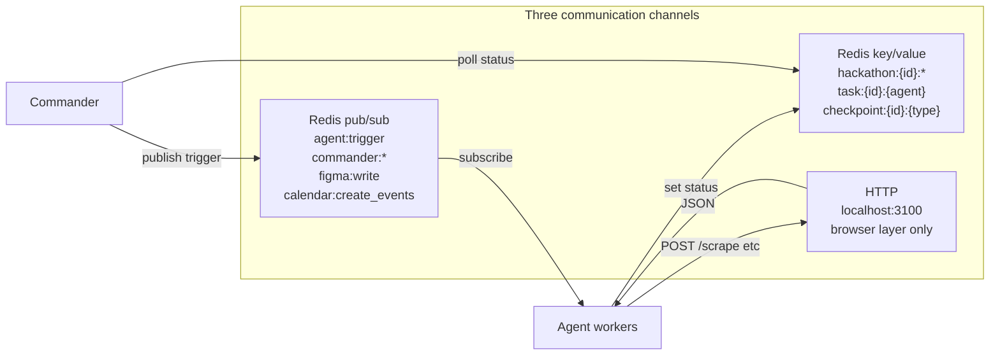
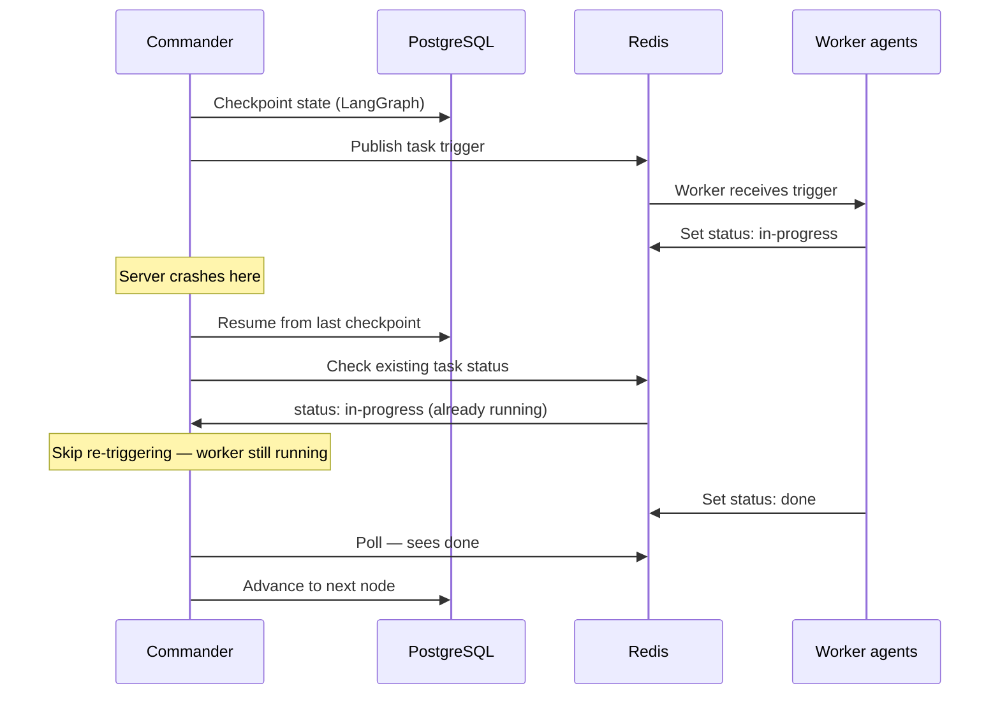

# 01 — Architecture

Forge is a 30-agent autonomous system organized into 8 layers. Python handles all agent logic. TypeScript handles browser automation only. They communicate via HTTP — never shared imports.

---

## System overview

```mermaid
graph TB
    subgraph HUMAN["Human  (~55 min total)"]
        H1["Concept pick\n15 min"]
        H2["Design approve\n10 min"]
        H3["Quality review\n20 min"]
        H4["Submit approve\n10 min"]
    end

    subgraph L0["Layer 0 — Command"]
        CMD["Commander\nLangGraph · PostgreSQL checkpoints · Temporal"]
    end

    subgraph L1["Layer 1 — Intelligence  (parallel)"]
        SCO["Hackathon Scout"]
        CA["Competitor Analyst"]
        JP["Judge Profiler"]
        SR["Sponsor Researcher"]
    end

    subgraph L2["Layer 2 — Strategy"]
        SD["Strategy Director"]
        PM["PM"]
        TA["Tech Architect"]
    end

    subgraph L3["Layer 3 — Build  (parallel)"]
        UX["UI/UX Designer (*)"]
        FE["Frontend Engineer"]
        BE["Backend Engineer"]
        IE["Integration Engineer"]
        TE["Test Engineer"]
        DO["DevOps"]
        SEC["Security Agent"]
    end

    subgraph L4["Layer 4 — Verify  (continuous)"]
        CR["Code Reviewer"]
        UA["UX Auditor [veto]"]
        PA["Performance Agent"]
    end

    subgraph L5["Layer 5 — Polish  (parallel)"]
        PO["Polish Agent"]
        CW["Copy Writer"]
        DS["Data Seeder"]
        BA["Brand Agent"]
    end

    subgraph L6["Layer 6 — Submission"]
        DP["Demo Producer"]
        PW["Pitch Writer"]
        SA["Submission Agent"]
    end

    subgraph L7["Layer 7 — Infrastructure  (always running)"]
        MK["Memory Keeper"]
        MON["Monitor"]
        CAL["Calendar Agent"]
        KU["Knowledge Updater"]
        OT["Outcome Tracker"]
    end

    subgraph INFRA["Self-hosted services"]
        PG[("PostgreSQL")]
        RD[("Redis")]
        QD[("Qdrant")]
        TMP["Temporal"]
    end

    subgraph EXT["External"]
        EH["ElectronHub\nhttps://api.electronhub.ai/v1"]
        BB["Browserbase"]
        VCL["Vercel"]
        RLW["Railway"]
        GCAL["Google Calendar API\n(service account)"]
        DISC["Discord webhooks"]
    end

    subgraph BROWSER["TypeScript — browser layer only"]
        BS["server.ts :3100\n/scrape /register /submit\n/screenshot /lighthouse /record-demo"]
    end

    subgraph DASHBOARD["Web Dashboard"]
        API["forge_web/ :3001\nFastAPI REST + WebSocket"]
        WEB["Next.js :3000\nDashboard UI"]
    end

    WEB -->|"/api/*"| API
    API --> RD
    HUMAN --> WEB

    CMD --> L1
    CMD --> L2
    CMD --> L3
    CMD --> L4
    CMD --> L5
    CMD --> L6

    H1 -.->|approve| CMD
    H2 -.->|approve| CMD
    H3 -.->|approve| CMD
    H4 -.->|approve| CMD

    L1 --> RD
    L2 --> RD
    L3 --> RD
    L4 --> RD
    L5 --> RD
    L6 --> RD
    CMD --> PG

    SCO -->|HTTP POST| BS
    SA -->|HTTP POST| BS
    UA -->|HTTP POST| BS
    DP -->|HTTP POST| BS
    BS --> BB

    L1 & L2 & L3 & L4 & L5 & L6 & L7 -->|all LLM calls| EH
    OT -->|post-judging trigger| MK
    FE --> VCL
    BE --> RLW

    MK --> QD
    CMD --> TMP
    CAL --> GCAL
    MON -.->|alerts| DISC
```

---

## Language split

**Why this split:** Python has the best AI/agent libraries — LangGraph, Mem0, Qdrant client, temporalio. The TypeScript Stagehand v3 SDK is significantly ahead of the Python SDK for Browserbase automation. The two layers communicate via HTTP only and never share imports.

The rule: **Python calls TypeScript. TypeScript never calls Python.**

---

## Communication model

**No agent calls another agent directly.** All coordination goes through Redis. The Commander publishes triggers; workers consume them and update their status keys; the Commander polls those keys to know when to proceed.

---

## Crash recovery

PostgreSQL checkpointing via LangGraph means the Commander survives crashes. Temporal provides workflow durability for long-running multi-day hackathons. Workers are stateless — they consume from Redis, complete their task, and update their status. If a worker dies mid-task, the Commander detects a stale `in-progress` after a timeout and retriggers.

---

## Key design decisions

| Decision | Rationale |
|---|---|
| Python primary, TS browser-only | Best AI libs in Python. Best browser automation in TS. HTTP bridge between them. |
| Redis pub/sub for agent coordination | Decoupled, debuggable, replay-friendly. No agent calls another directly. |
| SOP artifacts published to Redis immediately | Backend publishes `ApiContract` before full implementation — frontend unblocks and runs in parallel. |
| LangGraph + PostgreSQL checkpoints | Commander survives server crashes. State is durable, not in-memory. |
| UX Auditor has veto power | Prevents AI slop from reaching judges. Score < 7.0 or any anti-slop violation = blocked. |
| Knowledge Updater modifies `design_constitution.py` | Living knowledge (stacks, trends) updates automatically. Static laws never change. |
| Outcome Tracker closes the memory loop | `store_outcome()` is called after every judging day. Cross-hackathon learning actually accumulates. |
| Claude Code-inspired concurrency graph | `forge_tools.get_runnable_now()` replaces hardcoded `asyncio.gather` — agents start only when their declared dependencies finish. Security and Code Reviewer wait for frontend+backend. Test Engineer waits for both. |
| Per-agent cost tracking | `forge_tools.track_agent_cost()` records tokens and USD per agent call. Monitor alerts via Discord webhooks at $10 total. `forge status` shows running cost. Adapted from Claude Code's `cost-tracker.ts`. |
| PATCH protocol standardized | `forge_tools.parse_patches()` and `apply_patches()` centralize the FIND/REPLACE file-edit protocol. All agents that produce file modifications use this — eliminates ad-hoc string manipulation. Adapted from Claude Code's `FileEditTool`. |
| Memdir persistent agent notes | `forge_tools.write_agent_note()` gives agents a cross-session file-based memory. Notes are injected into system prompts on next run. Complements Mem0/Qdrant. Adapted from Claude Code's `src/memdir/`. |
| Cron trigger system | `forge_tools.schedule_cron_trigger()` + Monitor polling replaces manual `asyncio.sleep()` scheduling. Outcome Tracker, Calendar Agent, and Monitor all use it. Adapted from Claude Code's `ScheduleCronTool`. |
| Permission rule wildcards | `forge_tools.DEFAULT_PERMISSION_RULES` maps each agent to pre-approved tool patterns (`Bash(git *)`, `FileWrite(src/*)`). Adapted from Claude Code's permission rule system. |
| Sub-agent spawning | `forge_tools.spawn_sub_agent()` lets any agent dynamically create a child agent for a specific research or analysis task. Adapted from Claude Code's `AgentTool`. |
| Single ElectronHub gateway | One entry point for all LLM calls. Routing, fallback, cost tracking in one place. |

---

## Web dashboard

The web dashboard (`forge_web/` + `web/`) provides a browser-based alternative to the CLI.

**Backend** (`forge_web/`): A FastAPI application split into modular routers — hackathons, agents, checkpoints, logs, cost, analytics, config, design, batch operations, CLI bridge, WebSocket real-time updates, and health checks. The `forge_web.py` file at the project root is a thin shim that re-exports the app for backward compatibility.

**Frontend** (`web/`): A Next.js 15 application using shadcn/ui, Tailwind CSS, framer-motion, and SWR. Key pages: Dashboard (summary cards, pending approvals, agent activity), Hackathon Detail (pipeline timeline, checkpoints, artifacts, performance), Live Logs, Analytics, Settings/Config, Design Preview.

**Auth**: Protected by `FORGE_WEB_TOKEN` — set in `.env`, auto-generated by deploy scripts if missing. The Next.js middleware redirects unauthenticated requests to `/login`.

**Real-time**: The API exposes a WebSocket at `/api/ws` that streams agent status changes by polling Redis `task:*:*` keys and relaying `forge:agent_updates` pub/sub messages.
