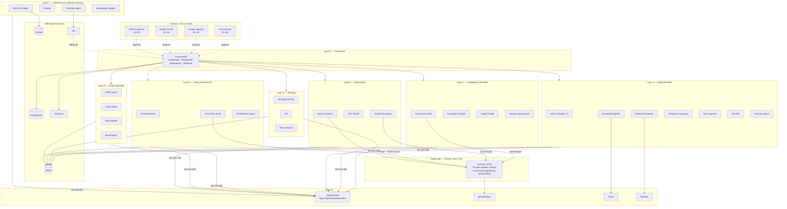
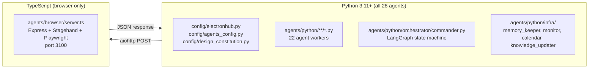
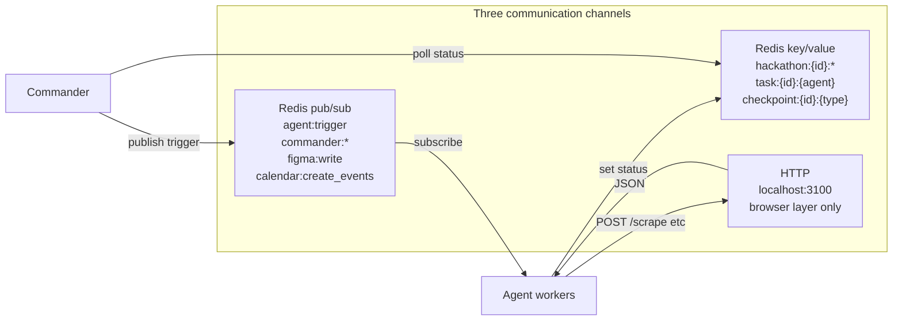
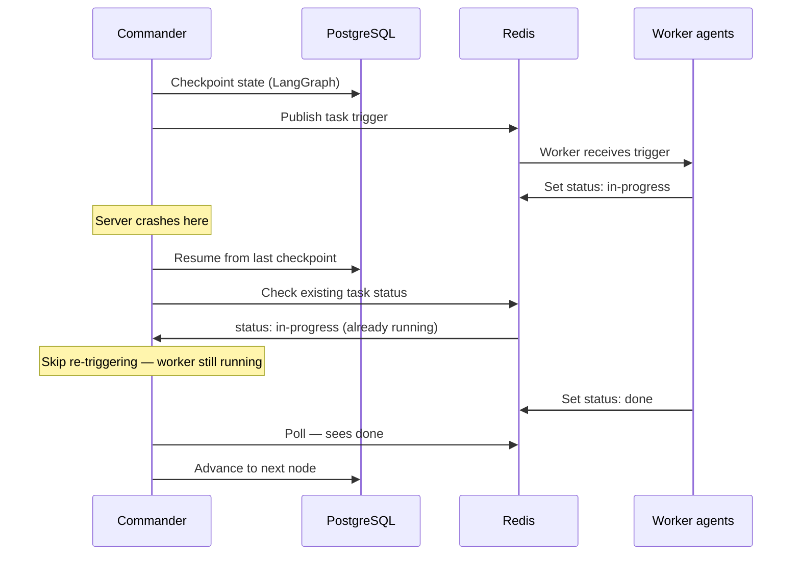

# 01 — Architecture

Forge is a 28-agent autonomous system organized into 8 layers. Python handles all agent logic. TypeScript handles browser automation only. They communicate via HTTP — never shared imports.

---

## System overview

---

## Language split

**Why this split:** Python has the best AI/agent libraries — LangGraph, Mem0, Qdrant client, temporalio. The TypeScript Stagehand v3 SDK is significantly ahead of the Python SDK for Browserbase automation. The two layers communicate via HTTP only and never share imports.

The rule: **Python calls TypeScript. TypeScript never calls Python.**

---

## Communication model

**No agent calls another agent directly.** All coordination goes through Redis. The Commander publishes triggers; workers consume them and update their status keys; the Commander polls those keys to know when to proceed.

---

## Crash recovery

PostgreSQL checkpointing via LangGraph means the Commander survives crashes. Temporal provides workflow durability for long-running multi-day hackathons. Workers are stateless — they consume from Redis, complete their task, and update their status. If a worker dies mid-task, the Commander detects a stale `in-progress` after a timeout and retriggers.

---

## Key design decisions

| Decision | Rationale |
|---|---|
| Python primary, TS browser-only | Best AI libs in Python. Best browser automation in TS. HTTP bridge between them. |
| Redis pub/sub for agent coordination | Decoupled, debuggable, replay-friendly. No agent calls another directly. |
| SOP artifacts published to Redis immediately | Backend publishes `ApiContract` before full implementation — frontend unblocks and runs in parallel. |
| LangGraph + PostgreSQL checkpoints | Commander survives server crashes. State is durable, not in-memory. |
| UX Auditor has veto power | Prevents AI slop from reaching judges. Score < 7.0 or any anti-slop violation = blocked. |
| Knowledge Updater modifies `design_constitution.py` | Living knowledge (stacks, trends) updates automatically. Static laws never change. |
| Single ElectronHub gateway | One entry point for all LLM calls. Routing, fallback, cost tracking in one place. |
