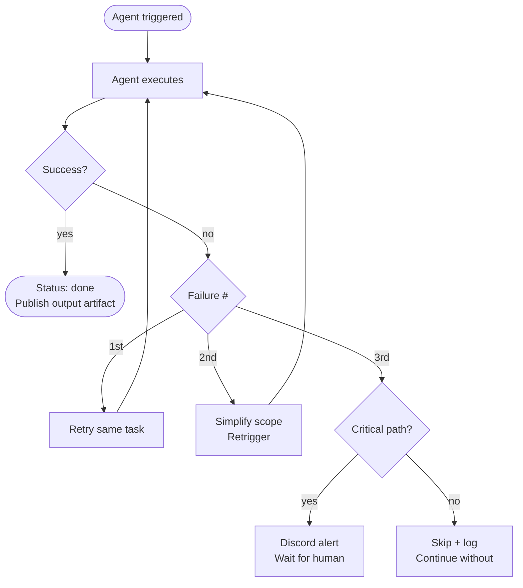

# 02 — Agent Roster

All 30 agents across 8 layers. Each entry covers: role, SOP artifacts consumed and produced, model tier, failure behavior, and where to find the implementation.

---

## Layer map

```mermaid
graph TD
    subgraph L0["Layer 0 — Command"]
        CMD["Commander\ncommander.py"]
    end
    subgraph L1["Layer 1 — Intelligence"]
        SCO["Hackathon Scout\nhackathon_scout.py"]
        CA["Competitor Analyst\nanalysis_agents.py"]
        JP["Judge Profiler\nanalysis_agents.py"]
        SR["Sponsor Researcher\nanalysis_agents.py"]
    end
    subgraph L2["Layer 2 — Strategy"]
        SD["Strategy Director\nstrategy_director.py"]
        PM["PM\npm_and_architect.py"]
        TA["Tech Architect\npm_and_architect.py"]
    end
    subgraph L3["Layer 3 — Build"]
        UX["UI/UX Designer (*)\nui_ux_designer.py"]
        FE["Frontend Engineer\nfrontend_and_backend.py"]
        BE["Backend Engineer\nfrontend_and_backend.py"]
        IE["Integration Engineer\nbuild_verify_agents.py"]
        TE["Test Engineer"]
        DO["DevOps"]
        SEC["Security Agent"]
    end
    subgraph L4["Layer 4 — Verify"]
        CR["Code Reviewer"]
        UA["UX Auditor [veto]\nux_auditor.py"]
        PA["Performance Agent"]
    end
    subgraph L5["Layer 5 — Polish"]
        PO["Polish Agent\npolish_agents.py"]
        CW["Copy Writer\npolish_agents.py"]
        DS["Data Seeder\npolish_agents.py"]
        BA["Brand Agent\npolish_agents.py"]
    end
    subgraph L6["Layer 6 — Submission"]
        DP["Demo Producer\nsubmission_pipeline.py"]
        PW["Pitch Writer\nsubmission_pipeline.py"]
        SA["Submission Agent\nsubmission_pipeline.py"]
    end
    subgraph L7["Layer 7 — Infra"]
        MK["Memory Keeper\nmemory_keeper.py"]
        MON["Monitor\nmonitor_and_calendar.py"]
        CAL["Calendar Agent\nmonitor_and_calendar.py"]
        KU["Knowledge Updater\nknowledge_updater.py"]
        OT["Outcome Tracker\noutcome_tracker.py"]
    end

    L0 --> L1 --> L2 --> L3 --> L4 --> L5 --> L6
    L7 -.-> L0
```



---

## Layer 0 — Command

### Commander
**File:** `agents/python/orchestrator/commander.py`
**Tier:** `standard` (claude-sonnet-4-5)
**Always on:** Yes — runs for the full hackathon duration

The LangGraph state machine that coordinates everything. Uses PostgreSQL for crash-recovery checkpointing and Temporal for workflow durability.

**Consumes:** `HackathonBrief` (from Scout via Redis)
**Produces:** `TaskAssignment`, `CommandPlan`

**LangGraph nodes:**
```
START → run_intelligence → generate_concepts → wait_concept_approval
      → run_planning → run_design → wait_design_approval
      → run_build → run_verification → wait_quality_review
      → run_polish → run_submission → END
```

**Failure behavior:** On agent failure, increments the failure counter. At 2 failures: simplifies task scope and retriggers. At 3 failures: flags to human via Discord and skips non-critical work.

---

## Layer 1 — Intelligence

All 4 run in **parallel** immediately after registration. No dependencies between them.

### Hackathon Scout
**File:** `agents/python/intelligence/hackathon_scout.py`
**Tier:** `fast` (claude-haiku-4-5)

Scrapes Devpost, MLH, Lablab, Devfolio via the browser layer. Scores each opportunity 0–100, registers to qualified hackathons (score ≥ 65), schedules calendar events.

**Consumes:** nothing
**Produces:** `HackathonBrief`

**Scoring rubric:**

| Category | Max | Threshold |
|---|---|---|
| Prize pool | 25 | $10k+ = 25, $5k+ = 15, $1k+ = 8 |
| Sponsor prizes | 20 | 3+ = 20, 2 = 14, 1 = 7 |
| Deadline buffer | 15 | 10+ days = 15, 5+ = 10, 3+ = 5 |
| Theme fit | 20 | LLM-scored: AI/automation = 20 |
| Competition size | 20 | <100 teams = 20, <300 = 10 |

**Calls browser layer:** `POST /scrape`, `POST /register`

---

### Competitor Analyst
**File:** `agents/python/intelligence/analysis_agents.py`
**Tier:** `standard`

Scrapes past winners from the hackathon page. Identifies what won, what failed, and what gap exists for differentiation.

**Consumes:** `HackathonBrief`
**Produces:** `CompReport` — top winning patterns, overused themes, underexplored opportunities, positioning recommendation

---

### Judge Profiler
**File:** `agents/python/intelligence/analysis_agents.py`
**Tier:** `standard`

Researches the judge panel's LinkedIn, GitHub, and public commentary. Characterizes the panel and recommends narrative framing, technical depth, and language level.

**Consumes:** `HackathonBrief`
**Produces:** `JudgeProfile` — panel character, resonance factors, recommended language, narrative framing

---

### Sponsor Researcher
**File:** `agents/python/intelligence/analysis_agents.py`
**Tier:** `standard`

Reads every sponsor's API docs. Ranks integrations by `prize_amount ÷ estimated_hours`. Identifies the 2–3 highest-value integrations that are natural to the product.

**Consumes:** `HackathonBrief`
**Produces:** `SponsorMap` — ranked opportunities with integration plans, estimated hours, UI visibility notes

---

## Layer 2 — Strategy

Runs after concept approval checkpoint. PM and Architect run in parallel after the concept is selected.

### Strategy Director
**File:** `agents/python/strategy/strategy_director.py`
**Tier:** `standard`

Synthesizes all 4 intelligence reports into exactly 3 distinct ranked project concepts. Scores each by win probability (40%), feasibility (30%), and sponsor prize potential (30%).

**Consumes:** `HackathonBrief`, `CompReport`, `JudgeProfile`, `SponsorMap`
**Produces:** `ConceptBrief` — 3 ranked concepts with scores, rationale, and recommended pick

**Human checkpoint triggered here:** concept_approval (24h timeout, auto-selects recommended if timed out)

---

### PM
**File:** `agents/python/strategy/pm_and_architect.py`
**Tier:** `standard`

Hard constraint: **exactly 2 core features**. Produces sprint plan with user stories, acceptance criteria, and the 90-second demo golden path.

**Consumes:** `ConceptBrief`, `HackathonBrief`, `JudgeProfile`
**Produces:** `ProjectPlan` — 2 features, demo golden path, timeline with 25% reserved for polish

---

### Tech Architect
**File:** `agents/python/strategy/pm_and_architect.py`
**Tier:** `standard`

Designs schema, API contract, and dependency graph. **Publishes `ApiContract` immediately** to Redis so Frontend can start in parallel with backend implementation.

**Consumes:** `ProjectPlan`
**Produces:** `DbSchema`, `ApiContract` (published immediately), `DependencyGraph`

---

## Layer 3 — Build

All 7 agents trigger simultaneously after design approval. Frontend waits for `ApiContract`, not backend completion.

### UI/UX Designer ⭐
**File:** `agents/python/build/ui_ux_designer.py`
**Tier:** `design` (claude-sonnet-4-5, temperature 0.7)

The most critical agent. Selects a design personality (developer_tool / data_tool / enterprise_workflow / ai_agent_realtime / consumer_product), generates a complete `DesignTokens` spec, calls Google Stitch for exploration, syncs to Figma via MCP, and produces `DESIGN.md` + `component-specs.json` + `design-tokens.ts`.

**Standard:** composio.dev, hex.tech, linear.app — dense, tool-native, data-forward
**Self-critiques:** Scores its own design against the rubric before publishing. Iterates if score < 7.0.

**Consumes:** `ProjectPlan`, `JudgeProfile`, `HackathonBrief`
**Produces:** `DesignSpec`, `DesignTokens`, `ComponentSpecs`, `DESIGN_MD`

**Human checkpoint triggered here:** design_approval (8h timeout)

---

### Frontend Engineer
**File:** `agents/python/build/frontend_and_backend.py`
**Tier:** `standard`

Runs in a Daytona sandbox. Scaffolds Next.js 14 + shadcn/ui, imports design tokens, generates all components from `ComponentSpecs` with full interactive states, generates pages from `DesignSpec` screens. Auto-fixes TypeScript/lint errors up to 3 times before escalating.

**Waits for:** `ApiContract` event on Redis (not backend completion)
**Consumes:** `DesignSpec`, `DesignTokens`, `ComponentSpecs`, `DESIGN_MD`, `ApiContract`
**Produces:** `FrontendApp`, `PreviewURL` (Vercel)

**Quality gates:** `tsc --noEmit` → `eslint` → `npm run build` → Vercel deploys → URL loads

---

### Backend Engineer
**File:** `agents/python/build/frontend_and_backend.py`
**Tier:** `standard`

Runs in a Daytona sandbox. **First action:** design and publish `ApiContract` to Redis (within 30 minutes of start). Then implements FastAPI + SQLAlchemy 2.0 async, runs pytest, deploys to Railway.

**Consumes:** `ProjectPlan`, `DbSchema`
**Produces:** `BackendAPI`, `ApiContract` (published immediately), `DemoSeedScript`

---

### Integration Engineer
**File:** `agents/python/build/build_verify_agents.py`
**Tier:** `standard`

Implements all sponsor API integrations from `SponsorMap`. Each integration is a self-contained module visible in the UI (badge + feature). Produces `SponsorIntegrationManifest` consumed by Submission Agent to check all prize categories.

**Consumes:** `SponsorMap`, `ProjectPlan`, `ApiContract`
**Produces:** `SponsorPlugins`, `SponsorIntegrationManifest`

---

### Test Engineer
**File:** `agents/python/build/build_verify_agents.py`
**Tier:** `bulk` (gpt-4o-mini)

Playwright e2e tests for the demo golden path. pytest for all API endpoints. Enforces: if it's on the demo path, it must have a test.

**Consumes:** `ApiContract`, `DESIGN_MD`, `ProjectPlan`
**Produces:** `TestSuite`, `CoverageReport`

---

### DevOps
**File:** `agents/python/build/build_verify_agents.py`
**Tier:** `fast`

Configures GitHub Actions CI, Vercel Git integration, Railway auto-deploy. CI must complete in < 3 minutes. Monitors that preview URLs are live and healthy on demo day.

**Consumes:** `ProjectPlan`, `ApiContract`
**Produces:** `CICDConfig`, `EnvConfig`, `DeploymentURLs`

---

### Security Agent
**File:** `agents/python/build/build_verify_agents.py`
**Tier:** `standard`

Scans for secrets (truffleHog), OWASP patterns (semgrep), dependency CVEs (npm audit + pip-audit). Blockers: API keys in git, SQL injection, hardcoded credentials. Issues a `SecurityReport` before quality review.

**Consumes:** `FrontendApp`, `BackendAPI`
**Produces:** `SecurityReport`

---

## Layer 4 — Verification

Continuous during build. UX Auditor has veto power.

### Code Reviewer
**File:** `agents/python/build/build_verify_agents.py`
**Tier:** `standard`

SWE-agent-style PR review. Blocks merges on: TypeScript `any`, hardcoded colors, missing loading/empty states, console.error in production paths, mobile overflow at 375px.

**Consumes:** `FrontendApp`, `BackendAPI`
**Produces:** `CodeReviewReport`

---

### UX Auditor 🛡️
**File:** `agents/python/verify/ux_auditor.py`
**Tier:** `design`

**Has veto power.** Browses the live Vercel URL via browser layer. Captures screenshots at 375px and 1440px. Runs Lighthouse. Scores 6 dimensions against the rubric. Any anti-slop violation = automatic block regardless of other scores. Score < 7.0 overall = blocked.

**Score dimensions (weighted):**
- Reference site match (2.0×)
- Data density (1.5×)
- Status visibility (1.5×)
- Visual hierarchy (1.5×)
- Interaction quality (1.0×)
- Demo path clarity (2.0×)

**If blocked:** Issues specific fix instructions to Polish Agent. After polish, re-audits. Will block twice before escalating to human.

**Consumes:** `PreviewURL`, `DesignSpec`, `DESIGN_MD`
**Produces:** `UXAuditReport`

---

### Performance Agent
**File:** `agents/python/build/build_verify_agents.py`
**Tier:** `fast`

Runs Lighthouse CLI (falls back to Playwright if unavailable). Minimum thresholds: Performance >= 85, Accessibility >= 85. Checks on 4G mobile simulation. Core Web Vitals: FCP < 2.0s, LCP < 3.5s, CLS < 0.1.

**Consumes:** `PreviewURL`
**Produces:** `PerformanceReport`

---

## Layer 5 — Polish

All 4 run in **parallel** after quality review approval.

### Polish Agent
**File:** `agents/python/polish/polish_agents.py`
**Tier:** `standard`

Applies every WARNING from the UX Audit Report. Adds micro-interactions (120ms ease-out transitions), shape-matched skeleton loaders, contextual empty states with SVG + helpful copy + CTA, branded 404/500 pages, favicon, og:image, meta tags.

**Consumes:** `FrontendApp`, `UXAuditReport`, `DesignSpec`
**Produces:** `PolishedApp`

---

### Copy Writer
**File:** `agents/python/polish/polish_agents.py`
**Tier:** `writing` (gpt-4o)

Audits every piece of text in the app. Rewrites: headlines (what it does, not how it feels), buttons (verb + object), placeholders (real examples), errors (what + how to fix), empty states (acknowledge + motivate + action). Calibrates to the judge panel's language preference from `JudgeProfile`.

**Consumes:** `FrontendApp`, `JudgeProfile`, `DesignSpec`
**Produces:** `PolishedCopy`

---

### Data Seeder
**File:** `agents/python/polish/polish_agents.py`
**Tier:** `bulk` (gpt-4o-mini, temperature 0.5)

Generates realistic demo data that tells a story. Real company names, domain-specific content, relative dates, internally consistent numbers. Produces `seed_data.json` and a `seed_script.py` that populates via the `/demo/seed` endpoint.

**Consumes:** `ProjectPlan`, `ApiContract`, `BackendAPI`
**Produces:** `SeedData`, `SeedScript`

---

### Brand Agent
**File:** `agents/python/polish/polish_agents.py`
**Tier:** `design`

Creates SVG logo (works at 16px–200px), favicon (32px + 16px), og:image description (1200×630px). Audits all screens for brand consistency: color token usage, font loading, icon library consistency, border radius, shadow values.

**Consumes:** `DesignSpec`, `DesignTokens`, `ProjectPlan`
**Produces:** `BrandKit`

---

## Layer 6 — Submission

Demo Producer and Pitch Writer run in **parallel**. Submission Agent runs last, after human approval.

### Demo Producer
**File:** `agents/python/submission/submission_pipeline.py`
**Tier:** `writing` (gpt-4o)

Writes a 90-second narration script. Generates audio via ElevenLabs (edge-tts fallback). Asks browser layer to screen-record the demo golden path. Composites video + audio via ffmpeg. Uploads to YouTube as unlisted.

**Script structure:** Hook (0:10) → Before (0:25) → Wow moment (0:55) → Impact (1:20) → CTA (1:30)

**Consumes:** `PolishedApp`, `ProjectPlan`, `DeploymentURLs`
**Produces:** `DemoVideo`

---

### Pitch Writer
**File:** `agents/python/submission/submission_pipeline.py`
**Tier:** `writing` (gpt-4o)

Generates README via `readmeai` CLI (ElectronHub fallback). Creates pitch deck via Gamma.app API. Writes submission description (≤220 words, leads with problem, calls out each sponsor integration). Calibrated to the judge panel's language from `JudgeProfile`.

**Consumes:** `ProjectPlan`, `JudgeProfile`, `CompReport`, `DeploymentURLs`, `SponsorIntegrationManifest`
**Produces:** `README`, `PitchDeck`, `SubmissionDescription`

---

### Submission Agent
**File:** `agents/python/submission/submission_pipeline.py`
**Tier:** `fast`

Pre-submission checklist: live URL returns 200, GitHub repo is public, video URL is playable, description ≤ 220 words, human has approved. Then calls browser layer `POST /submit` to fill the Devpost/MLH/Lablab form and check all sponsor prize categories.

**Consumes:** `PolishedApp`, `DemoVideo`, `README`, `PitchDeck`, `SubmissionDescription`, `SponsorIntegrationManifest`
**Produces:** `SubmissionURL`

---

## Layer 7 — Infrastructure

Always running. Not triggered by Commander — they run as long-lived background workers.

### Memory Keeper
**File:** `agents/python/infra/memory_keeper.py`
**Tier:** `fast`

Two systems: Mem0 (episodic — what worked and failed, per hackathon) + Qdrant (vector search — code artifacts, design patterns, submission copy, hackathon briefs, judge profiles). Before any generation, agents check for similar past artifacts at 0.85 similarity threshold. Hit = adapt existing (saves ~50% tokens).

**5 Qdrant collections:** `code-artifacts`, `design-patterns`, `submission-copy`, `hackathon-briefs`, `judge-profiles`

---

### Monitor
**File:** `agents/python/infra/monitor_and_calendar.py`
**Tier:** `fast`

Tracks latency (P50/P95/P99), error rate, and cost per agent. Circuit breaker: 3 consecutive failures = pause agent + Discord webhook alert. Polls all active hackathons every 60 seconds. Publishes health reports to Redis.

---

### Calendar Agent
**File:** `agents/python/infra/monitor_and_calendar.py`
**Tier:** `fast`

Creates 5 Google Calendar events per hackathon via the Google Calendar API (service account): concept kickoff, design review, quality review, submit approval, and demo day reminder. Each event has the exact approval URL embedded in the description.

---

### Knowledge Updater
**File:** `agents/python/infra/knowledge_updater.py`
**Tier:** `standard`

Runs 5 research tasks in parallel (trending libraries, winning concepts, winning aesthetic, frontend stack, backend stack). Surgically updates only the `LIVING_KNOWLEDGE` section of `config/design_constitution.py`. Validates the updated file is valid Python and all frozen sections are intact before writing. Backs up the original before any write.

**Frozen sections it never touches:** `STATIC_DESIGN_LAWS`

---

### Outcome Tracker
**File:** `agents/python/infra/outcome_tracker.py`
**Tier:** `standard`
**Agent #30 — The loop closer.**

After judging day, polls the hackathon page for results, scrapes placements and any public feedback, then actually calls `store_outcome()` on MemoryKeeper — the call that was architecturally present but never wired. Also feeds winning signals into `LIVING_KNOWLEDGE` so the Knowledge Updater has real outcome data, not just training knowledge.

Triggered automatically by Calendar Agent 36 hours after submission deadline. Retries every 6 hours if results aren't posted yet. Can also be run manually:

```bash
python agents/python/infra/outcome_tracker.py --hackathon-id devpost-123
```

**Produces:** `OutcomeReport` — placement, prize, what worked, what failed, learning signals fed into `LIVING_KNOWLEDGE` via Memory Keeper

---

## Agent failure handling


