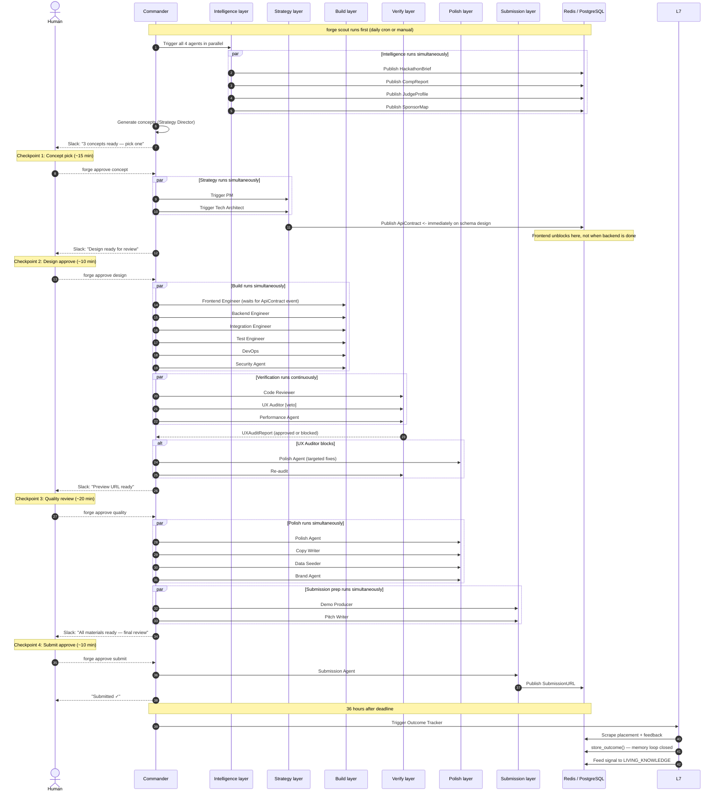
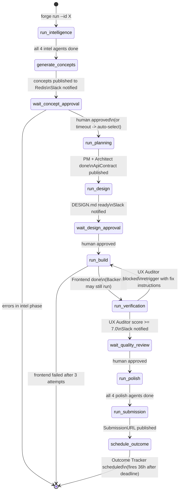
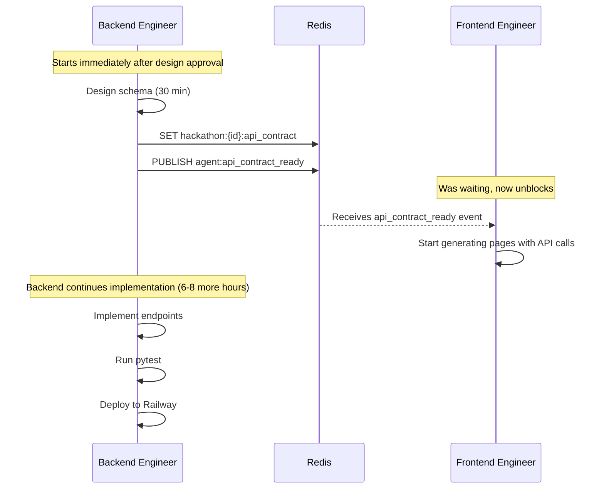
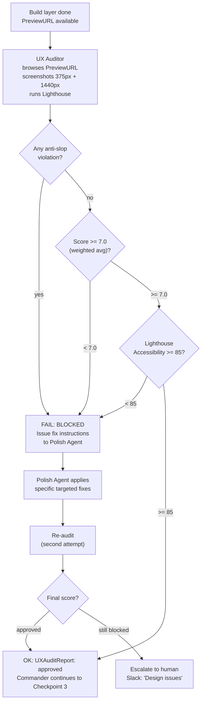
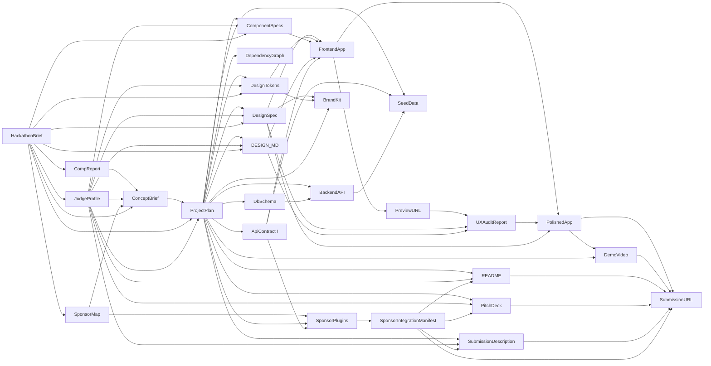

# 03 — Execution Flow

A complete 24-hour hackathon run from `forge scout` to `SubmissionURL`. Maps every phase, parallel track, human checkpoint, and dependency.

---

## Full lifecycle

---

## Parallel execution map

```mermaid
gantt
    title Forge execution timeline (24h hackathon)
    dateFormat HH:mm
    axisFormat %H:%M

    section Intelligence
    Scout + register          :done, 00:00, 01:00
    Competitor Analyst        :done, 00:00, 01:00
    Judge Profiler            :done, 00:00, 01:00
    Sponsor Researcher        :done, 00:00, 01:00

    section Checkpoint 1
    Human: concept pick       :crit, 01:00, 01:15

    section Strategy
    Strategy Director         :done, 01:15, 01:45
    PM                        :done, 01:45, 02:30
    Tech Architect            :done, 01:45, 02:30

    section Checkpoint 2
    Human: design approve     :crit, 02:30, 02:40

    section Design
    UI/UX Designer            :done, 02:40, 05:30

    section Build (parallel)
    Frontend Engineer         :active, 05:30, 15:30
    Backend Engineer          :active, 02:40, 10:30
    Integration Engineer      :active, 05:30, 11:30
    Test Engineer             :active, 05:30, 11:30
    DevOps                    :active, 05:30, 07:30
    Security Agent            :active, 13:30, 14:30

    section Verify (continuous)
    Code Reviewer             :active, 05:30, 15:30
    UX Auditor                :active, 05:30, 15:30
    Performance Agent         :active, 05:30, 15:30

    section Checkpoint 3
    Human: quality review     :crit, 15:30, 16:00

    section Polish (parallel)
    Polish Agent              :done, 16:00, 18:00
    Copy Writer               :done, 16:00, 17:00
    Data Seeder               :done, 16:00, 17:00
    Brand Agent               :done, 16:00, 17:00

    section Submission prep (parallel)
    Demo Producer             :done, 16:00, 18:00
    Pitch Writer              :done, 16:00, 17:00

    section Checkpoint 4
    Human: submit approve     :crit, 18:00, 18:10

    section Submit
    Submission Agent          :done, 18:10, 18:40
```

---

## Commander state machine

---

## The critical dependency: ApiContract

**Why this matters:** The frontend can generate type-safe API call code immediately from the contract, without waiting for backend implementation. This compresses the critical path by hours on a 24-hour hackathon.

---

## UX Audit decision tree

---

## Human checkpoint details

| Checkpoint | Trigger | Timeout | Auto-fallback | What you see |
|---|---|---|---|---|
| **concept_approval** | After Strategy Director | 24h | Auto-selects recommended concept | 3 concepts with scores, rationale, win-probability |
| **design_approval** | After UI/UX Designer | 8h | Proceeds with current design | DESIGN.md link, Figma URL, self-critique score |
| **quality_review** | After UX Auditor passes | 4h | Proceeds to polish | Live Vercel URL, audit score, Lighthouse scores |
| **submission_approval** | After Demo + Pitch done | 2h | Does NOT auto-submit | Preview URL, video URL, description preview, Devpost form dry-run screenshot |

> Note: submission_approval never auto-submits regardless of timeout. It requires explicit human confirmation.

---

## SOP artifact dependency graph

`⚡` = published immediately by Architect, does not wait for implementation
