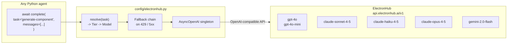
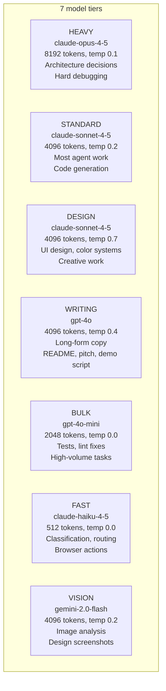
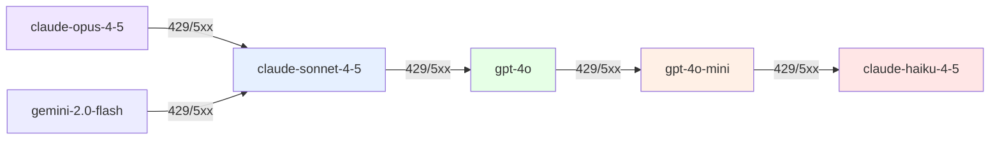

# 04 — LLM Routing

All LLM calls in Forge go through `config/electronhub.py`. This is the single gateway — no agent ever instantiates `AsyncOpenAI` directly.

---

## Architecture



**Streaming:** `complete()` in `config/electronhub.py` uses `stream=True` with `stream_options={"include_usage": True}` for chat completions (deltas are concatenated client-side, usage data is captured from the final chunk). That keeps long generations from sitting behind a single blocking HTTP response, which helps avoid proxy idle timeouts (e.g. Cloudflare 504). Streams have a **600 second** total ceiling and a **120 second** stall timeout (no new chunks). `complete_json` goes through `complete()`, so it inherits the same streaming and cost-tracking behavior.

---

## Model tiers



**The DESIGN tier is the same model as STANDARD (claude-sonnet-4-5) but runs at temperature 0.7.** Creative design work needs more variation — the default 0.2 produces overly generic color choices and component names.

---

## Task → Tier routing table

| Task | Tier | Model | Why |
|---|---|---|---|
| `scout-hackathons` | FAST | haiku | High-volume classification |
| `score-hackathon` | FAST | haiku | Simple scoring rubric |
| `analyze-competitors` | STANDARD | sonnet | Nuanced competitive analysis |
| `profile-judges` | STANDARD | sonnet | Inference from public profiles |
| `research-sponsor-apis` | STANDARD | sonnet | Docs research + scoring |
| `generate-concepts` | STANDARD | sonnet | Product strategy thinking |
| `write-user-stories` | STANDARD | sonnet | PM work |
| `create-sprint-plan` | STANDARD | sonnet | Planning with constraints |
| `design-api-contract` | STANDARD | sonnet | API design |
| `design-db-schema` | STANDARD | sonnet | Schema design |
| `debug-architecture` | **HEAVY** | opus | Hard problems only |
| `design-system-create` | **DESIGN** | sonnet 0.7 | Creative design work |
| `generate-color-palette` | **DESIGN** | sonnet 0.7 | Aesthetic decisions |
| `write-component-spec` | **DESIGN** | sonnet 0.7 | Design system specification |
| `critique-design` | **DESIGN** | sonnet 0.7 | Design judgment |
| `generate-design-tokens` | **DESIGN** | sonnet 0.7 | Token system creation |
| `audit-visual-hierarchy` | VISION | gemini | Image analysis |
| `generate-brand-identity` | **DESIGN** | sonnet 0.7 | Brand creative |
| `generate-component` | STANDARD | sonnet | React code generation |
| `generate-page` | STANDARD | sonnet | Next.js page generation |
| `generate-api-route` | STANDARD | sonnet | FastAPI endpoint |
| `fix-typescript-error` | STANDARD | sonnet | Error requires context |
| `fix-lint-error` | **BULK** | gpt-4o-mini | High volume, simple fixes |
| `write-tests` | **BULK** | gpt-4o-mini | High volume |
| `write-pytest` | **BULK** | gpt-4o-mini | High volume |
| `integrate-sponsor-api` | STANDARD | sonnet | Integration logic |
| `write-migrations` | STANDARD | sonnet | DB migration logic |
| `fix-python-error` | STANDARD | sonnet | Debugging |
| `review-code` | STANDARD | sonnet | Code review |
| `audit-ux-flow` | **DESIGN** | sonnet 0.7 | UX judgment |
| `check-accessibility` | STANDARD | sonnet | WCAG analysis |
| `run-lighthouse-analysis` | FAST | haiku | Simple scoring |
| `security-scan` | STANDARD | sonnet | Security analysis |
| `polish-animations` | STANDARD | sonnet | UI polish |
| `rewrite-ux-copy` | **WRITING** | gpt-4o | Long-form copy quality |
| `seed-demo-data` | **BULK** | gpt-4o-mini 0.5 | Creative data, lower cost |
| `generate-logo` | **DESIGN** | sonnet 0.7 | SVG design |
| `generate-og-image` | **DESIGN** | sonnet 0.7 | Visual design |
| `write-demo-script` | **WRITING** | gpt-4o | Narration quality |
| `write-readme` | **WRITING** | gpt-4o | Technical writing |
| `write-pitch-deck` | **WRITING** | gpt-4o | Persuasive writing |
| `write-submission-copy` | **WRITING** | gpt-4o | Persuasive copy |
| `browser-act` | FAST | haiku | Simple browser commands |
| `browser-extract` | FAST | haiku | Structured extraction |

---


## Overriding models

Any tier's model can be overridden without touching code. Edit `.env` (gitignored):

```bash
# Use a cheaper model for HEAVY during development
FORGE_MODEL_HEAVY=claude-sonnet-4-6

# Use GPT-4.1 for all writing tasks
FORGE_MODEL_WRITING=gpt-4.1

# Bump max tokens for standard tier (16k default)
FORGE_MAX_TOKENS_STANDARD=32000
```

All `FORGE_MODEL_*` and `FORGE_MAX_TOKENS_*` variables are set in `.env`.

## Model catalog (2026-03-31)

| Model | SWE-bench | Context | Output | $/MTok in/out |
|---|---|---|---|---|
| `claude-opus-4-6` | 80.8% | 1M | 128k | $5/$25 |
| `claude-sonnet-4-6` | 79.6% | 1M | 64k | $3/$15 |
| `claude-haiku-4-5` | — | 200k | 8k | $0.25/$1.25 |
| `gpt-4.1` | 54.6% | 1M | 32k | $2/$8 |
| `gpt-4.1-mini` | 31.6% | 1M | 16k | $0.40/$1.60 |
| `gpt-4.1-nano` | 9.8% | 1M | 16k | $0.10/$0.40 |
| `gpt-5-nano` | — | 400k | 16k | $0.05/$0.40 |

## Fallback chain



The fallback logic in `complete()`:
1. Detect `APIStatusError` with status 429, 500, 502, 503, or 504
2. Look up `FALLBACK[current_model]`
3. Log the downgrade at WARNING level
4. Sleep `2^attempt` seconds (1s, 2s, 4s)
5. Retry with fallback model (max 3 attempts total)

If all retries are exhausted, `RuntimeError` propagates to the Commander, which increments the agent's failure counter.

---

## Usage patterns

### Simple completion
```python
from config.electronhub import complete

result = await complete(
    task="generate-component",  # determines model automatically
    messages=[{"role": "user", "content": "..."}],
    system_prompt=AGENT.system_prompt,  # from agents_config.py
)
```

### Typed JSON response
```python
from config.electronhub import complete_json
from pydantic import BaseModel

class ProjectPlan(BaseModel):
    project_name: str
    features: list[str]

plan = await complete_json(
    task="create-sprint-plan",
    response_model=ProjectPlan,
    messages=[{"role": "user", "content": "..."}],
)
# Returns a validated ProjectPlan instance — never a raw dict
```

### Batch completions (for high-volume tasks)
```python
from config.electronhub import complete_batch

tasks = [
    {"task": "write-pytest", "messages": [{"role": "user", "content": f"Test: {fn}"}]}
    for fn in functions_to_test
]
# Runs 5 concurrent — respects ElectronHub rate limits
results = await complete_batch(tasks, concurrency=5)
```

### Embeddings (for Qdrant)
```python
from config.electronhub import embed

vector = await embed("AI agent for customer support automation")
# Returns list[float], 1536 dims (text-embedding-3-small)
```

---

## Cost optimization rules

1. **Never use HEAVY for bulk tasks.** Opus is reserved for `debug-architecture` — one of the rarest tasks.
2. **Seed data uses gpt-4o-mini at temperature 0.5.** It's a high-volume creative task — BULK tier with slightly higher temperature for variety.
3. **Cache embeddings.** Before embedding any text, check Qdrant for an existing embedding. Never re-embed the same hackathon brief.
4. **DESIGN tier makes expensive choices.** The UI/UX Designer runs 5+ DESIGN-tier calls per hackathon. This is intentional — design quality is what wins.
5. **complete_batch with concurrency=5.** Don't run 20 sequential lint-fix calls. Batch them.

---

## Adding a new task

1. Add it to `TASK_TIER` in `config/electronhub.py`
2. Pick the tier that matches the task's complexity and volume
3. Use it in agent code: `await complete(task="your-new-task", ...)`
4. The routing, fallback, and cost tracking are automatic

```python
# In config/electronhub.py — add to TASK_TIER dict:
"my-new-task": Tier.STANDARD,

# In agent code:
result = await complete(task="my-new-task", messages=[...])
```

---

## Cost tracking

Forge tracks per-call token usage and cost automatically.

**How it works:**

1. `complete()` passes `stream_options={"include_usage": True}` to the OpenAI-compatible API. The final stream chunk contains `prompt_tokens`, `completion_tokens`, and `total_tokens`.

2. Context variables (`set_llm_context(hackathon_id, agent_id)`) tell `complete()` which hackathon and agent are making the call. The commander sets this automatically before each agent runs.

3. After each successful LLM call, `complete()` calls `track_agent_cost()` from `config/forge_tools.py`, which accumulates token counts and estimated USD in the Redis key `cost:{hackathon_id}:{agent_id}` (TTL 7 days).

4. Pricing is in `TOKEN_COSTS` in `config/forge_tools.py` — USD per million tokens for each model. Unknown models fall back to $3/$15 (input/output).

**API endpoints:**

| Endpoint | Returns |
|---|---|
| `GET /api/hackathon/{id}/cost` | Total USD, total tokens, per-agent breakdown (cost, input/output tokens, call count) |
| `GET /api/hackathon/{id}/elapsed` | Total elapsed seconds, per-agent elapsed times |

**Accessing usage in agent code:**

```python
from config.electronhub import complete, get_last_usage, set_llm_context

set_llm_context(hackathon_id, agent_id)
result = await complete(task="my-task", messages=[...])
usage = get_last_usage()
# {"model": "claude-sonnet-4-6", "prompt_tokens": 2400, "completion_tokens": 800, "elapsed_s": 12.3}
```
