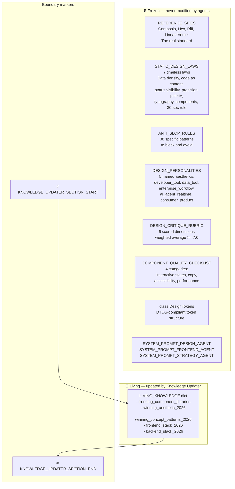
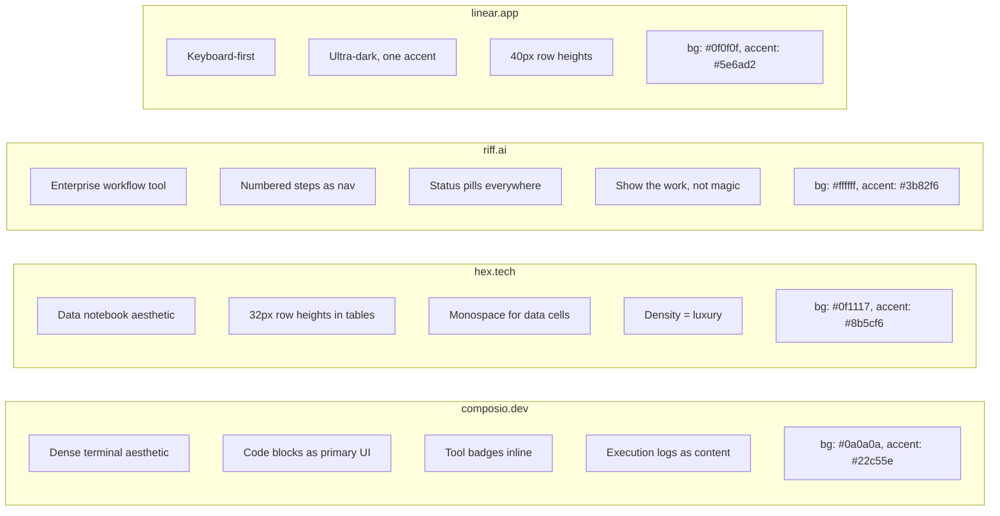
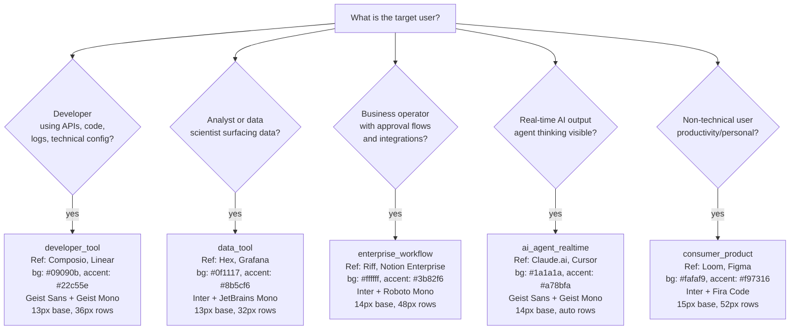
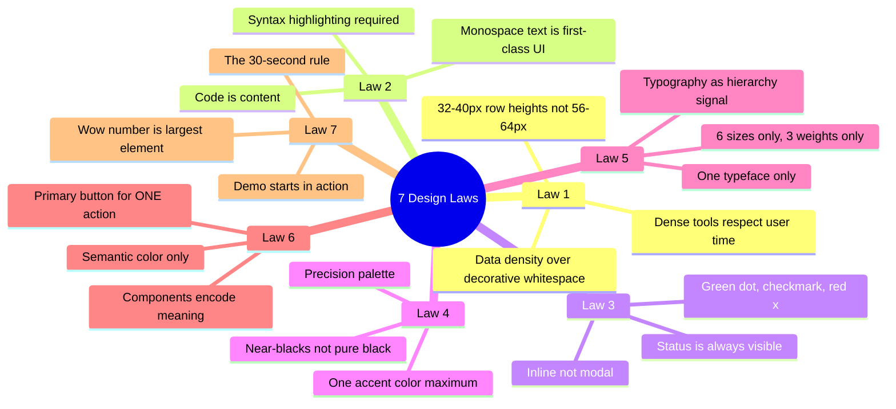
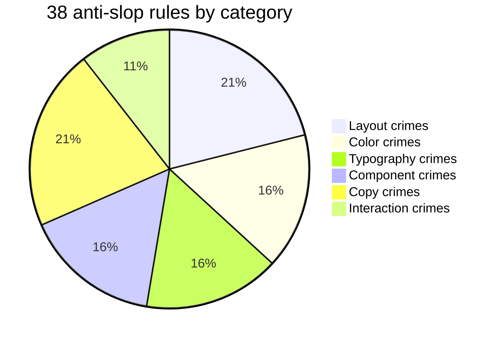
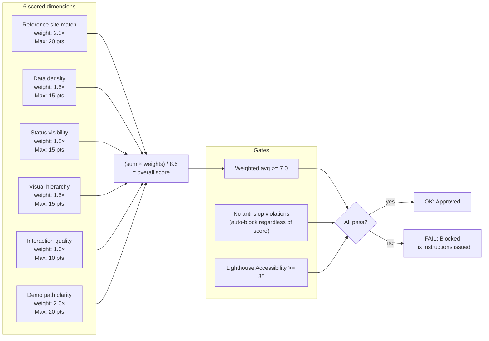
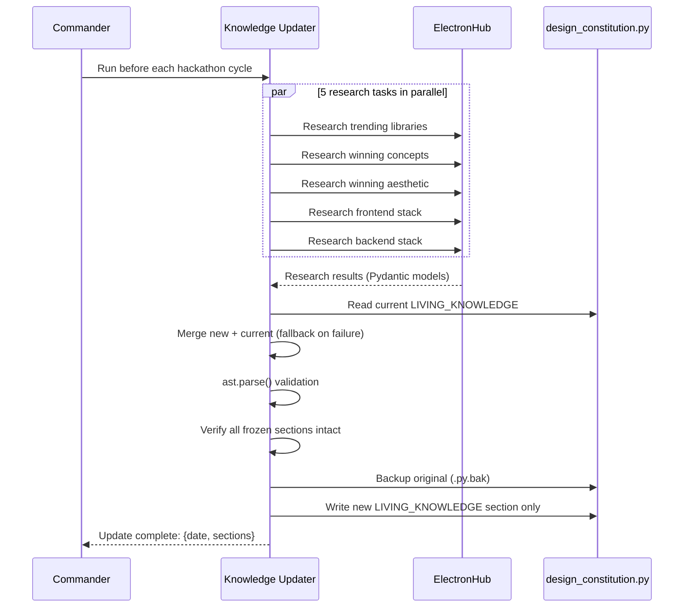
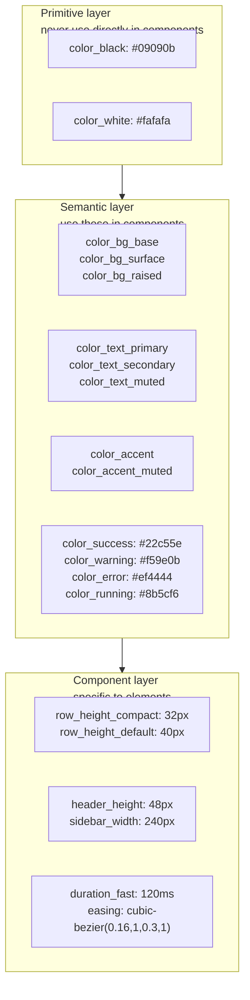
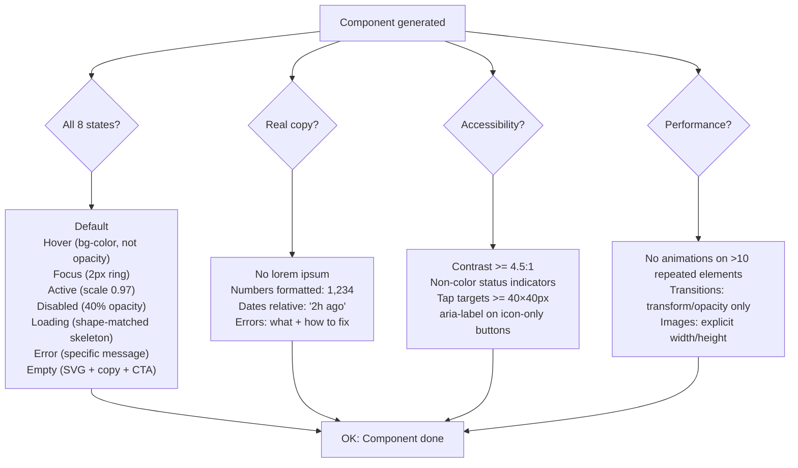

# 05 — Design Constitution

The design brain of Forge. Everything UI-related flows through `config/design_constitution.py`. It has two parts: a **frozen section** that encodes timeless design principles, and a **living section** that agents update via web research.

---

## File structure

---

## The reference standard

Forge's design agents are calibrated to specific real companies — not abstract principles.

**The test:** Does this look like it belongs on one of these sites? If not, the UX Auditor blocks it.

---

## The 5 design personalities

---

## The 7 static design laws

---

## Anti-slop categories

**The highest-priority rules** (UX Auditor auto-blocks on these):

| # | Rule | Why it matters |
|---|---|---|
| 1 | Centered hero + tagline + gradient background | Most common AI slop output in 2026 |
| 3 | Three-column emoji feature grid | Signals "I used a template" |
| 8 | Blue-purple gradient as brand color | Peak AI slop indicator |
| 9 | Glassmorphism as primary aesthetic | Outdated by 2024, still everywhere |
| 27 | "Revolutionize your workflow" in any headline | Judges have read this 500 times |
| 31 | Empty state: just "No items found" | No recovery path = bad UX |

---

## UX Audit scoring

---

## The living knowledge system

**Validation before write:** The updater parses the updated file as Python AST. If it has a syntax error, it refuses to write. It also verifies all 8 frozen section markers are still present. If any check fails, the backup is preserved and an error is raised.

---

## Design token structure (DTCG)

The personality selection fills the semantic layer. Agents always reference tokens, never hardcoded hex values.

---

## Component quality gates

Every component must pass all items before it is considered done:

