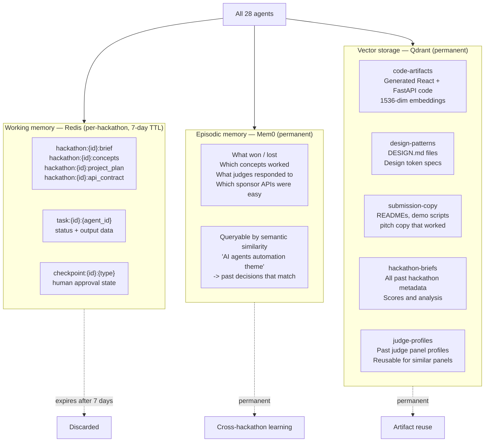
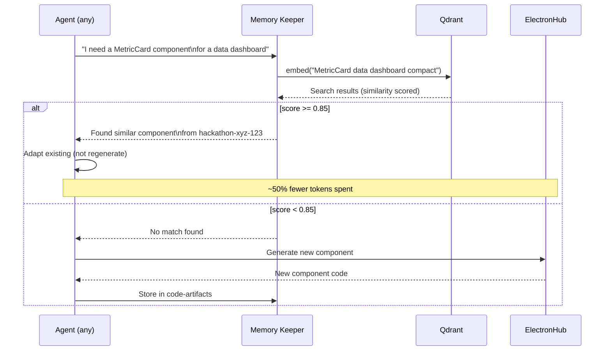

# 06 — Memory System

Forge gets smarter with every hackathon. Two systems work together: Mem0 for episodic memory (what worked and failed) and Qdrant for vector search (code, designs, copy, briefs, judges).

---

## Architecture



---

## Reuse loop



**Threshold 0.85:** High on purpose. Forge only reuses something if it's very similar — avoids using a wrong-aesthetic component just because the description partially matched.

---

## Qdrant collections

| Collection | Key | What's stored | Similarity threshold |
|---|---|---|---|
| `code-artifacts` | `hackathon_id + artifact_type + name` | React components, FastAPI routes, complete pages | 0.85 |
| `design-patterns` | `hackathon_id + screen_count + personality` | Full DESIGN.md files, DesignTokens specs | 0.80 |
| `submission-copy` | `hackathon_id + copy_type` | READMEs, demo scripts, pitch copy | 0.75 |
| `hackathon-briefs` | `hackathon_id` | Full HackathonBrief + score + outcome | 0.70 |
| `judge-profiles` | `hackathon_id` | JudgeProfile for past panels | 0.80 |

All collections use `text-embedding-3-small` (1536 dimensions) via ElectronHub.

---

## Mem0 episodic memory

```mermaid
graph LR
    subgraph STORE["What gets stored (end of each hackathon)"]
        OUT["result: won/placed/submitted/failed"]
        CON["concept used"]
        WW["what_worked: list of specific items"]
        WF["what_failed: list of specific items"]
        PZ["prize_won: string or null"]
        UA["ux_audit_score: float"]
    end

    subgraph QUERY["When it's queried"]
        Q1["Strategy Director\n'AI agent automation theme'\nbefore generating concepts"]
        Q2["Judge Profiler\n'engineering-heavy panel'\nbefore profiling"]
        Q3["Design Agent\n'developer tool dark aesthetic'\nbefore selecting personality"]
    end

    STORE -->|stored after hackathon| MEM0[("Mem0\nvector-backed\ndeduplication")]
    MEM0 -->|relevant past decisions| QUERY
```



**Mem0 backend:** Qdrant (dedicated `mem0-agent-memory` collection). Mem0 handles chunking, deduplication, and relevance scoring automatically. Forge just calls `.add()` and `.search()`.

---

## Storage write patterns

### Writing a code artifact
```python
from agents.python.infra.memory_keeper import MemoryKeeper

memory = MemoryKeeper()

# After generating a component
await memory.store_code_artifact(
    hackathon_id="devpost-abc",
    artifact_type="react-component",   # or "api-route", "schema", "page"
    name="MetricCard",
    code=generated_tsx_code,
    description="Compact metric card with trend indicator for data dashboards",
)
```

### Checking for reuse before generating
```python
existing = await memory.find_similar_component(
    spec="compact metric card showing a number and trend arrow",
    artifact_type="react-component",
    threshold=0.85,
)

if existing:
    # Adapt this instead of generating from scratch
    adapted = await adapt_existing_component(existing["code"], new_spec)
else:
    # Generate new and store
    new_code = await generate_component(spec)
    await memory.store_code_artifact(...)
```

### Storing a hackathon outcome
```python
await memory.store_outcome(
    hackathon_id="devpost-abc",
    hackathon_name="AI Innovation Challenge 2026",
    outcome={
        "result": "won",
        "prize_won": "Best Use of Sponsor API — $2,000",
        "concept": "Supply chain risk agent with ERP integration",
        "what_worked": [
            "Composio-style execution log UI impressed judges",
            "Sponsor API integration was prominently visible in the demo",
            "Data Seeder made demo look like a real product",
        ],
        "what_failed": [
            "Initial design was too consumer-product; had to switch to developer_tool personality",
            "UX Auditor blocked twice before design passed",
        ],
        "ux_audit_score": 8.2,
    },
)
```

---

## Memory initialization

On every `forge run` start, the Commander verifies collections exist:

```bash
# Via start.sh (automated)
python3 -c "
import asyncio
from agents.python.infra.memory_keeper import ensure_collections
asyncio.run(ensure_collections())
"

# Or manually
python3 -c "
import asyncio
from agents.python.infra.memory_keeper import MemoryKeeper
asyncio.run(MemoryKeeper().ensure_collections())
"
```

If Qdrant is fresh (first run), this creates all 5 collections with correct vector dimensions.

---

## Growth over time

```
Artifact reuse rate over time (illustrative):

Run 1   ░░░░░░░░░░░░░░░░░░░░  0%
Run 5   █░░░░░░░░░░░░░░░░░░░  8%
Run 10  ████░░░░░░░░░░░░░░░░  20%
Run 20  ███████░░░░░░░░░░░░░  35%
Run 50  ███████████░░░░░░░░░  55%
```

By run 10+, the system reuses ~20% of components (particularly: data tables, status badges, sidebar navigation, auth flows). By run 50+, ~50% of common components are adapted from past runs rather than generated from scratch — roughly halving the LLM cost for those components.

The strategy intelligence compounds more directly: Mem0 accumulates specific decisions across dozens of hackathons, making the Strategy Director significantly more calibrated about what wins on specific platforms (Devpost vs Lablab vs MLH have different judge cultures).
