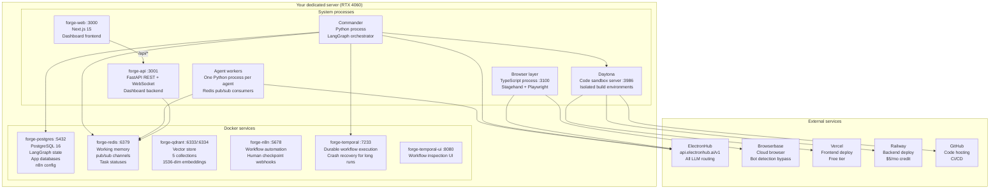
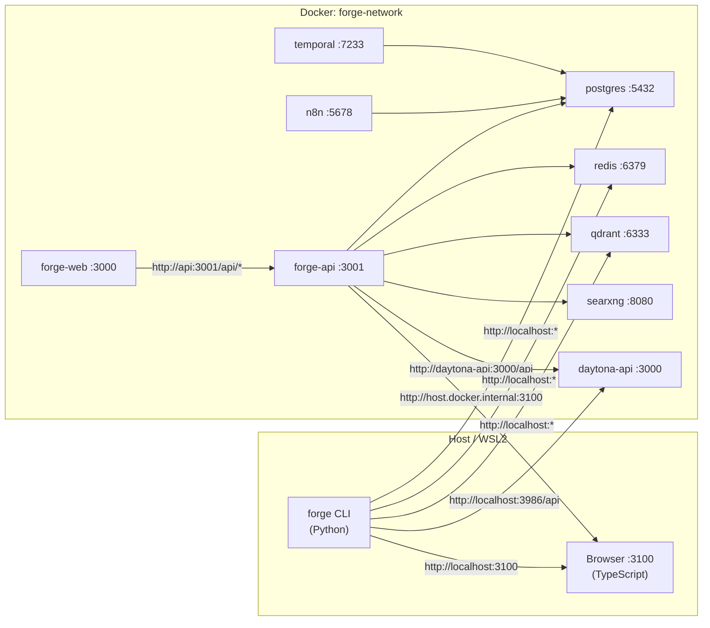
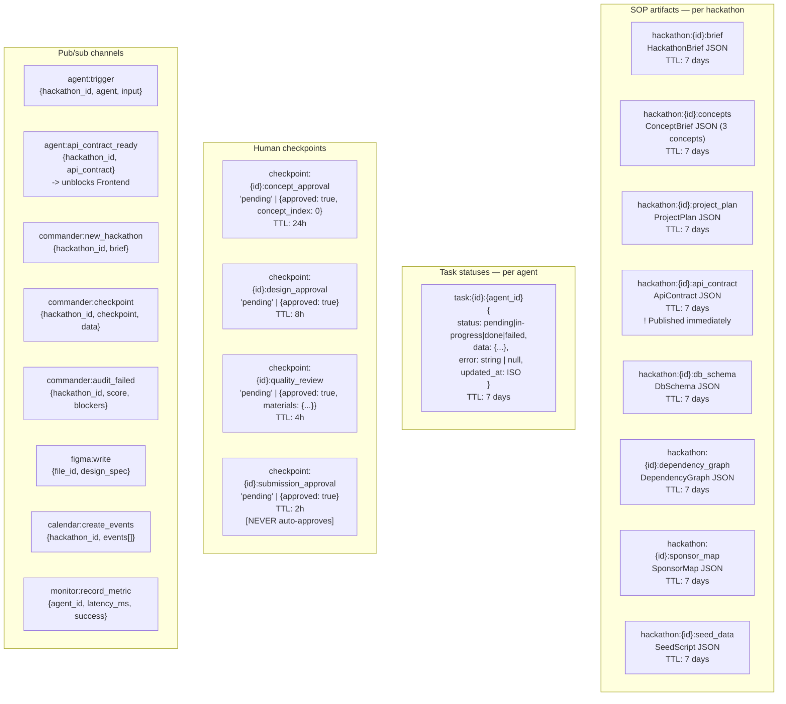
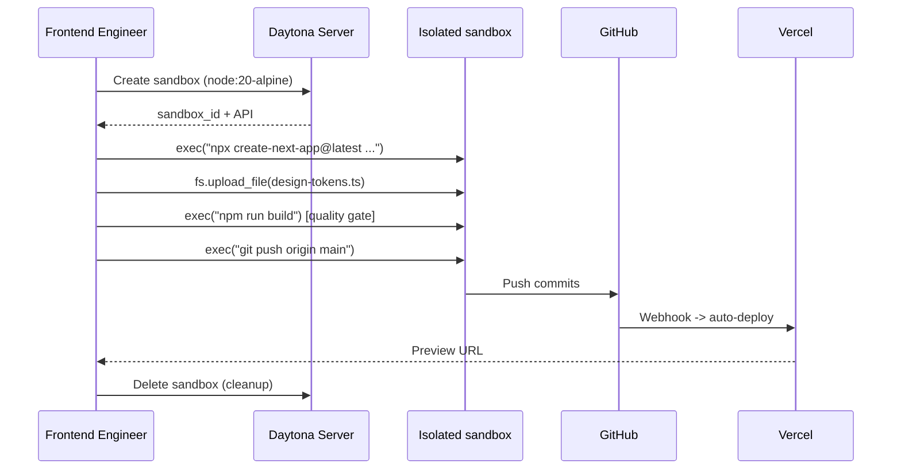
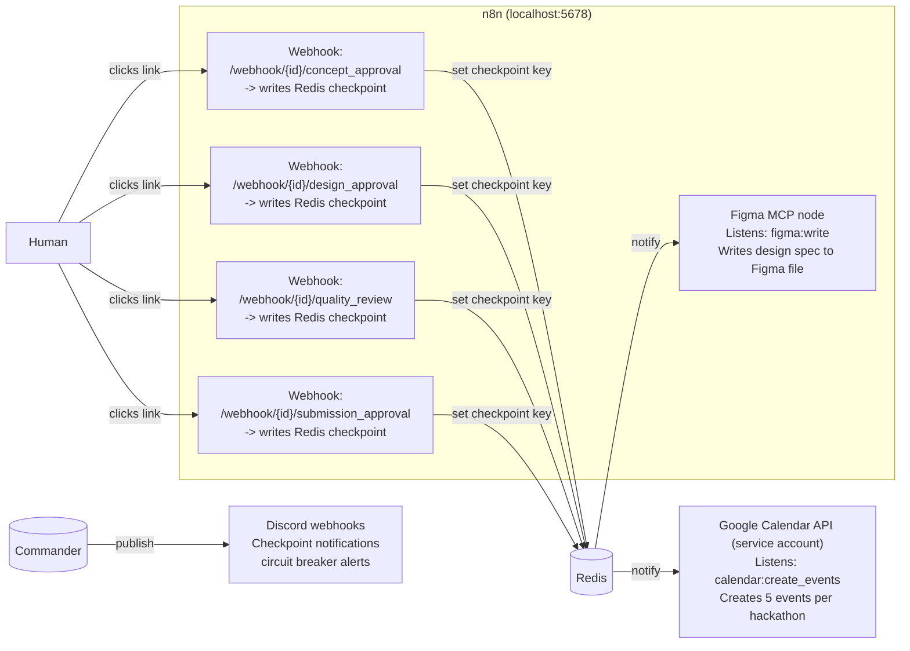

# 07 — Infrastructure

All services self-hosted on your dedicated server. The only external paid dependencies are Browserbase ($49/mo) and ElevenLabs ($5/mo).

---

## Service map



---

## Web dashboard

The Forge web dashboard replaces the terminal-only workflow with a browser UI.

| Component | Container | Port | Stack |
|---|---|---|---|
| **API backend** | `forge-api` | 3001 | FastAPI, `forge_web/` package |
| **Frontend** | `forge-web` | 3000 | Next.js 15, shadcn/ui, Tailwind |

**Environment**: `FORGE_WEB_TOKEN` (required) — set in `.env`, auto-generated by `forge-deploy.sh` / `sync.sh` / `scripts/start.sh` if missing. Used for both HTTP auth and WebSocket auth.

**Docker**: Both services are defined in `docker-compose.yml` with `env_file: - .env`. The `web` service rewrites `/api/*` to `forge-api:3001`. Health checks hit `/health` (API) and `/login` (frontend).

**Key features**: Real-time agent pipeline view, concept/design/quality checkpoint approval, per-agent cost breakdown, agent execution times, live logs, hackathon management (run/reroll/delete), system health monitoring, settings/config editor.

---

## Ports reference

| Host Port | Container | Docker Service Name | Internal Port | Type | Health Check | Description |
|---|---|---|---|---|---|---|
| 3000 | forge-web | `web` | 3000 | Docker | `GET /` | Next.js 15 dashboard UI |
| 3001 | forge-api | `api` | 3001 | Docker | `GET /health` | FastAPI REST + WebSocket backend |
| 5432 | forge-postgres | `postgres` | 5432 | Docker | `pg_isready` | PostgreSQL 16 — LangGraph state, app DB, n8n |
| 6379 | forge-redis | `redis` | 6379 | Docker | `redis-cli ping` | Working memory, pub/sub, task statuses |
| 6333 | forge-qdrant | `qdrant` | 6333 | Docker | `GET /readyz` (needs `api-key` header) | Vector store — 5 collections, 1536-dim |
| 6334 | forge-qdrant | `qdrant` | 6334 | Docker | — | Qdrant gRPC (unused) |
| 5678 | forge-n8n | `n8n` | 5678 | Docker | `GET /healthz` | Workflow automation, checkpoint webhooks |
| 7233 | forge-temporal | `temporal` | 7233 | Docker | TCP connect | Durable workflow execution |
| 8080 | forge-temporal-ui | `temporal-ui` | 8080 | Docker | `GET /` | Temporal inspection dashboard |
| 8081 | forge-searxng | `searxng` | 8080 | Docker | `GET /healthz` | Self-hosted metasearch (ForgeSearch) |
| 3100 | — | — | 3100 | Host process | `GET /health` | Browser layer (Stagehand + Playwright) |
| 3986 | daytona-api | `daytona-api` | 3000 | Docker | `GET /health` | Isolated code sandbox server |
| 4000 | daytona-proxy | `daytona-proxy` | 4000 | Docker | — | Daytona sandbox preview proxy |
| 3003 | daytona-runner | `daytona-runner` | 3003 | Docker | — | Daytona sandbox runner |
| 2222 | daytona-ssh-gateway | `daytona-ssh-gateway` | 2222 | Docker | — | Daytona SSH access |
| 5556 | daytona-dex | `daytona-dex` | 5556 | Docker | `GET /dex/.well-known/openid-configuration` | OIDC identity provider |
| 6000 | daytona-registry | `daytona-registry` | 6000 | Docker | — | OCI container registry |
| 9001 | daytona-minio | `daytona-minio` | 9001 | Docker | — | Object storage console |

---

## Service communication map

How each service reaches other services. Use this as the definitive reference when configuring URLs.



### URL resolution rules

Services run in **two contexts**: the host (CLI, browser layer) and Docker containers. The same logical service is reached by different URLs depending on context:

| Service | From Host / CLI | From Docker Container | Env Var |
|---|---|---|---|
| PostgreSQL | `localhost:5432` | `postgres:5432` | `DATABASE_URL` |
| Redis | `localhost:6379` | `redis:6379` | `REDIS_URL` |
| Qdrant | `localhost:6333` | `qdrant:6333` | `QDRANT_URL` |
| SearXNG | `localhost:8081` | `searxng:8080` | `SEARXNG_URL` |
| Daytona API | `localhost:3986/api` | `daytona-api:3000/api` | `DAYTONA_API_URL` / `DAYTONA_SERVER_URL` |
| Browser layer | `localhost:3100` | `host.docker.internal:3100` | `BROWSER_SERVER_URL` |
| Forge API | `localhost:3001` | `api:3001` | `NEXT_PUBLIC_API_URL` |

**How it works**: The `.env` file contains host-side URLs (e.g. `QDRANT_URL=http://localhost:6333`). The `docker-compose.yml` `environment:` section overrides them with Docker-internal URLs for the `api` container (e.g. `QDRANT_URL: "http://qdrant:6333"`). The `forge_web/constants.py` `SERVICE_REGISTRY` is the single source of truth for the full list.

### Key networking details

- **`forge-network`**: All Forge containers share this Docker bridge network. Created by `docker compose up -d`.
- **Daytona stack**: Joins `forge-network` as `external: true` via `docker-compose.daytona.yml`. Must start AFTER the main stack.
- **Browser layer**: Runs as a host process (not in Docker). Docker containers reach it via `host.docker.internal` + `extra_hosts: host-gateway`.
- **Port mapping `3986:3000`**: Daytona API listens on port 3000 internally but is published as 3986 to avoid conflict with forge-web (which uses 3000).
- **Port mapping `8081:8080`**: SearXNG listens on 8080 internally but is published as 8081 to avoid conflict with temporal-ui (which uses 8080).

---

## Redis schema



### Redis server settings (`docker-compose.yml`)

Forge runs Redis 7 with:

- **Eviction:** `volatile-lru` (`--maxmemory-policy volatile-lru`) with `--maxmemory 512mb` — only keys with a TTL are candidates when memory is full (not `allkeys-lru`).
- **AOF persistence:** `appendonly yes`, `appendfsync everysec` — durability with at-most ~1s loss on crash.
- **RDB snapshots:** `save "60 100"` and `save "300 1"` — periodic dumps in addition to AOF.
- **TCP:** `tcp-keepalive 60` — detect dead peers faster on long-lived connections.

---

## PostgreSQL schema

```sql
-- LangGraph uses its own checkpointing tables (set up via AsyncPostgresSaver.setup())

-- Forge application tables
CREATE TABLE hackathons (
  id TEXT PRIMARY KEY,
  name TEXT NOT NULL,
  url TEXT NOT NULL,
  platform TEXT,              -- devpost | mlh | lablab | devfolio
  theme TEXT,
  deadline TIMESTAMPTZ,
  score INTEGER,
  status TEXT DEFAULT 'discovered',
  concept_json JSONB,
  project_url TEXT,
  submission_url TEXT,
  created_at TIMESTAMPTZ DEFAULT NOW(),
  updated_at TIMESTAMPTZ DEFAULT NOW()
);

CREATE TABLE agent_tasks (
  id UUID PRIMARY KEY DEFAULT gen_random_uuid(),
  hackathon_id TEXT REFERENCES hackathons(id),
  agent_id TEXT NOT NULL,
  status TEXT DEFAULT 'pending',
  input_json JSONB,
  output_json JSONB,
  error TEXT,
  iterations INTEGER DEFAULT 0,
  started_at TIMESTAMPTZ,
  completed_at TIMESTAMPTZ,
  created_at TIMESTAMPTZ DEFAULT NOW()
);

CREATE TABLE ux_audit_reports (
  id UUID PRIMARY KEY DEFAULT gen_random_uuid(),
  hackathon_id TEXT REFERENCES hackathons(id),
  preview_url TEXT,
  overall_score FLOAT,
  approved BOOLEAN,
  report_json JSONB,
  created_at TIMESTAMPTZ DEFAULT NOW()
);
```

---

## Daytona sandboxes



Each build creates an isolated Daytona sandbox. Frontend and Backend each get their own sandbox with no shared state. After deployment, sandboxes are deleted to free resources. This means the server's disk doesn't fill up across many hackathon runs.

### Self-hosted Daytona setup

Daytona runs as a separate Docker Compose stack on the same `forge-network`:

```bash
# 1. Start the main Forge stack first (creates forge-network)
docker compose up -d

# 2. Start the Daytona sandbox infrastructure
docker compose -f docker-compose.daytona.yml up -d
```

Services started: `daytona-api` (port 3986), `daytona-runner`, `daytona-proxy` (port 4000), `daytona-ssh-gateway` (port 2222), `daytona-dex` (port 5556), `daytona-db`, `daytona-redis`, `daytona-registry` (port 6000), `daytona-minio` (port 9001).

**Generate an API key:**

1. Open [http://localhost:3986](http://localhost:3986) in a browser
2. Log in with `dev@daytona.io` / `password`
3. Go to Settings → API Keys → Generate
4. Copy the key and set it in `.env`:
   ```
   DAYTONA_API_KEY=your_generated_key
   DAYTONA_API_URL=http://localhost:3986/api
   ```
5. Restart the API container: `docker compose restart api`

**From inside Docker:** The forge-api container can reach Daytona at `http://daytona-api:3000/api` (internal network).

---

## n8n workflows

n8n handles webhook-driven human checkpoints and Figma MCP. **Calendar** uses the **Google Calendar API (service account)** (Forge subscribes to Redis `calendar:create_events`). **Checkpoint and breaker alerts** go out via **Discord webhooks**.



---

## Cost breakdown

| Service | Monthly | Notes |
|---|---|---|
| Browserbase | $49 | Non-negotiable — bot detection bypass |
| ElevenLabs | $5 | 30k chars = ~33 demo videos/mo |
| Vercel | $0 | 10 projects free tier |
| Railway | ~$2 | $5/mo credit, backend uses ~$2 |
| GitHub Actions | $0 | 2000 min/mo free |
| Google Stitch | $0 | 350 gen/mo free |
| Figma | $0 | Free tier (1 project) |
| Gamma.app | $0 | 10 AI decks/mo free |
| **Total** | **~$56/mo** | |

**ROI:** One $5k sponsor prize = positive ROI for 89 months. One $500 sponsor prize = positive for ~9 months.

---

## Starting the stack

```bash
# Full startup sequence (automated by scripts/start.sh)
docker compose up -d

# Wait for health
until docker exec forge-postgres pg_isready -U ${POSTGRES_USER:-backbone}; do sleep 1; done
until docker exec forge-redis redis-cli -a $REDIS_PASSWORD ping; do sleep 1; done
until curl -sf http://localhost:6333/readyz; do sleep 2; done

# Initialize Qdrant collections
python3 -c "import asyncio; from agents.python.infra.memory_keeper import ensure_collections; asyncio.run(ensure_collections())"

# Start browser layer (TypeScript)
cd agents/browser && npm start &

# Start Daytona (if not already running)
daytona server start --yes &

# Verify everything
./forge test
```
