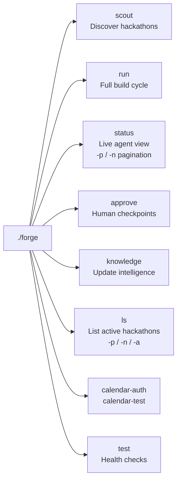
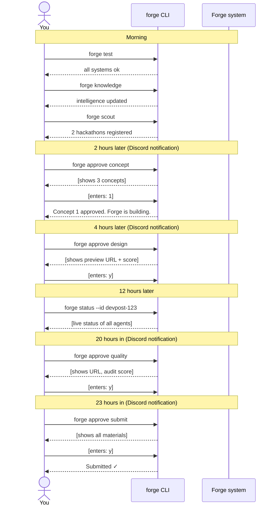

# 08 — CLI Reference

All commands use the `forge` executable at the project root. Run `pip install -e .` to also install it as a system command.

---

## Command map



---

## `forge scout`

Discovers and scores hackathons. Registers to qualified ones (score ≥ 65). Schedules calendar events.

```bash
forge scout           # discover, score, register to top 3
forge scout --dry-run # discover and score only — no registration
```

**Output:**
```
  ███████╗ ██████╗ ██████╗  ██████╗ ███████╗
  ...
  30 agents. One submission. Every time.

Scouting hackathons...

Found 4 qualifying hackathons:

  87/100  AI Innovation Summit 2026
         8d left · $22,000 total · 3 sponsor prizes · REGISTERED

  79/100  DevNetwork AI + ML Hackathon
         12d left · $15,000 total · 2 sponsor prizes · REGISTERED

  71/100  Lablab.ai Automation Sprint
         6d left · $8,000 total · 1 sponsor prizes · REGISTERED

  → Calendar events scheduled. Check your Google Calendar.
  → Run 'forge status' to see active hackathons.
```

**What happens internally:**
1. `POST /scrape` to browser layer — scrapes Devpost, Lablab, Devfolio
2. Each hackathon scored via ElectronHub (theme fit is LLM-scored)
3. Top 3 qualifying hackathons: stored in Redis + Qdrant, registered via `POST /register`
4. Calendar events created via Google Calendar API (service account)
5. `commander:new_hackathon` published to Redis — triggers Commander

---

## `forge run`

Full autonomous build cycle for a specific hackathon.

```bash
forge run --id devpost-123          # run specific hackathon
forge run --listen                  # daemon mode — auto-starts when Scout finds hackathons
```

**Daemon mode** is the typical production usage. It keeps running and starts a new Commander workflow automatically every time Scout registers a new hackathon.

**Getting the hackathon ID:** Run `forge ls` to see all active IDs.

---

## `forge status`

Live view of all 30 agent statuses for active hackathons.

```bash
forge status          # show all active hackathons
forge status --id devpost-123  # show specific hackathon
forge status -p 2     # page number (--page N)
forge status -n 25    # hackathons per page (--per-page N)
```

**Output:**
```
AI Innovation Summit 2026
  ID: devpost-123 · 7d remaining

  intelligence  ✓ Hackathon Scout  ✓ Competitor Analyst  ✓ Judge Profiler  ✓ Sponsor Researcher
  strategy      ✓ Strategy Director  ✓ PM  ✓ Tech Architect
  design        ✓ UI/UX Designer
  build         ⟳ Frontend Eng.  ✓ Backend Eng.  ✓ Integration Eng.  · Test Eng.  · DevOps  · Security Agent
  verify        ⟳ Code Reviewer  · UX Auditor  · Performance Agent
  polish        · Polish Agent  · Copy Writer  · Data Seeder  · Brand Agent
  submission    · Demo Producer  · Pitch Writer  · Submission Agent

  ⚡ Waiting for you: Quality review ready → 'forge approve quality --id devpost-123'
```

**Status icons:**
- `✓` — done
- `⟳` — in-progress
- `·` — pending (not started yet)
- `✗` — failed

---

## `forge approve`

The human checkpoint interface. Detects which checkpoint is pending automatically.

```bash
forge approve                       # auto-detect pending checkpoint
forge approve concept               # specifically approve concept selection
forge approve concept --id devpost-123  # for specific hackathon
forge approve design
forge approve quality
forge approve submit
```

### Concept approval

```
Choose a concept for: devpost-123

  [1] Supply Chain Risk Intelligence  score: 82/100
       Detect supply chain risks before they cascade
       Why it wins: Aligns with 3 of 5 judges' operations/finance background. No past winner
       in this category (gap in CompReport). RiskWise won $20k at Microsoft doing this — proven category.

  [2] Developer Workflow Automation  score: 74/100
       Automate repetitive dev tasks across GitHub and Jira
       Why it wins: Technical judges will understand it immediately...

  [3] Customer Support Intelligence  score: 68/100
       Route and resolve support tickets before they escalate
       Why it wins: Strong sponsor alignment with Zendesk prize category...

Enter concept number [1-3] (default: recommended):
```

### Design approval

```
Checkpoint: Design Approve

  preview_url: https://abc123.vercel.app
  figma_url: https://figma.com/file/XYZ
  design_md: /tmp/hackathon-devpost-123/DESIGN.md
  personality: developer_tool
  self_critique_score: 8.3/10
  screens: 4
  components: 12 (8 demo-critical)

Approve? [y/N]
```

### Quality review

```
Checkpoint: Quality Review

  preview_url: https://abc123.vercel.app
  ux_audit_score: 7.8/10
  lighthouse_performance: 88
  lighthouse_accessibility: 92
  description_preview: Supply chain risk agent that monitors 50 vendors...

  ⚠️  Check the URL on your phone too (375px matters to judges)

Approve? [y/N]
```

### Submit approval

```
Checkpoint: Submit Approve

  preview_url: https://abc123.vercel.app
  video_url: https://youtu.be/abc123 (90 seconds, unlisted)
  readme: /tmp/hackathon-devpost-123/README.md
  description_preview: Every logistics team has a blind spot: the vendor...
  dry_run_screenshot: /tmp/hackathon-devpost-123/submission-preview.png

  ⚠️  Submitting to: https://devpost.com/hackathons/ai-innovation-2026
  ⚠️  This cannot be undone

Approve? [y/N]
```

---

## `forge knowledge`

Updates Forge's design and strategy intelligence by doing live web research.

```bash
forge knowledge           # run research, update design_constitution.py
forge knowledge --dry-run # preview what would be updated, no file write
```

**Output:**
```
Updating Forge intelligence...
→ Researching: trending UI libraries, winning concepts, current stacks
→ This takes ~2 minutes (5 parallel research tasks)

✓ Knowledge updated: 2026-03-30
✓ Sections updated: trending_component_libraries, winning_aesthetic_2026,
                    winning_concept_patterns_2026, frontend_stack_2026, backend_stack_2026
✓ Static sections preserved: STATIC_DESIGN_LAWS, ANTI_SLOP_RULES, DESIGN_PERSONALITIES,
                              DESIGN_CRITIQUE_RUBRIC, COMPONENT_QUALITY_CHECKLIST,
                              system prompts, DesignTokens
```

**Run this before each hackathon cycle.** The knowledge updater researches what's winning at hackathons right now and what UI/stack trends are current, then writes only the `LIVING_KNOWLEDGE` section of `config/design_constitution.py`.

---

## `forge ls`

Lists all hackathons Forge is currently tracking.

```bash
forge ls
forge ls -p 2      # page number (--page N)
forge ls -n 50     # items per page (--per-page N)
forge ls -a        # show all without pagination (--all)
```

**Output:**
```
Active hackathons (3):

  devpost-123
    AI Innovation Summit 2026  score:87 · 7d · $22,000

  lablab-456
    Automation Sprint  score:71 · 5d · $8,000

  devfolio-789
    Healthcare AI Hackathon  score:68 · 11d · $12,000
```

---

## `forge calendar-auth`

Prints **Google Calendar service account** setup instructions (credentials path, calendar sharing, one-time steps). Run once when wiring calendar integration.

```bash
forge calendar-auth
```

---

## `forge calendar-test`

Creates a **test calendar event** to verify Google Calendar connectivity after setup.

```bash
forge calendar-test
```

If this fails, run `forge calendar-auth` and complete the documented steps first.

---

## `forge test`

Runs health checks on all systems. Run this after `bash scripts/start.sh` to verify everything is working.

```bash
forge test
```

**Output (all passing):**
```
Running Forge health checks...

  ✓ ElectronHub
  ✓ Browser layer
  ✓ Redis
  ✓ Qdrant
  ✓ Design constitution

  All systems operational. Forge is ready.
```

**Output (browser layer down):**
```
Running Forge health checks...

  ✓ ElectronHub
  ✗ Browser layer  not running
  ✓ Redis
  ✓ Qdrant
  ✓ Design constitution

  Some systems need attention. Run 'bash scripts/start.sh' to start services.
```

---

## Typical daily workflow



---

## Environment requirements

All commands require `.env` to be present with at minimum:

```bash
ELECTRONHUB_API_KEY=...    # required — all LLM calls fail without this
BROWSERBASE_API_KEY=...    # required — Scout and Submission fail without this
REDIS_URL=...              # required — all agents communicate via Redis
DATABASE_URL=...           # required — Commander state machine
```

Full `.env` template: `.env.example`

---

## Running specific agents for testing

Outside of a full forge run, you can trigger individual agent workers directly:

```bash
# Run the knowledge updater
python agents/python/infra/knowledge_updater.py --dry-run

# Run the Scout in dry-run
python agents/python/intelligence/hackathon_scout.py --dry-run --once

# Test ElectronHub connection
python scripts/test_run.py --test electronhub

# Test browser layer
python scripts/test_run.py --test browser

# Full system dry-run
python scripts/test_run.py --dry-run
```
