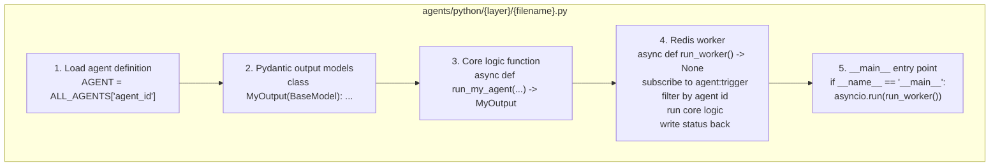

# 09 — Agent Development Guide

How to add a new agent, modify an existing one, or debug a broken run.

---

## Anatomy of an agent

Every Forge agent follows the same pattern:



---

## Adding a new agent

### Step 1 — Define it in `config/agents_config.py`

```python
MY_NEW_AGENT = AgentDef(
    id="my_new_agent",
    name="My New Agent",
    layer="build",          # intelligence|strategy|build|verify|polish|submission|infra
    description="What this agent does in one sentence.",
    model_tier="standard",  # heavy|standard|design|writing|bulk|fast|vision
    system_prompt="""You are...

    [Specific persona and constraints for this agent]""",
    tools=["redis", "daytona"],  # tools this agent uses
    max_iterations=10,
    timeout_minutes=60,
    sop_inputs=["ProjectPlan"],    # artifact types this agent READS
    sop_outputs=["MyNewArtifact"], # artifact types this agent WRITES
)

# Add to ALL_AGENTS registry
ALL_AGENTS = {
    ...existing agents...,
    "my_new_agent": MY_NEW_AGENT,
}
```

### Step 2 — Create the Python file

```python
# agents/python/{layer}/my_new_agent.py
"""
My New Agent
Consumes: ProjectPlan
Produces: MyNewArtifact
"""
from __future__ import annotations
import asyncio, json, logging, os
from pydantic import BaseModel
from redis.asyncio import Redis
from config.electronhub import complete_json
from config.agents_config import ALL_AGENTS

logger = logging.getLogger(__name__)
AGENT = ALL_AGENTS["my_new_agent"]


class MyNewArtifact(BaseModel):
    result: str
    details: list[str]


async def run_my_new_agent(
    hackathon_id: str,
    project_plan: dict,
) -> MyNewArtifact:
    artifact = await complete_json(
        task="create-sprint-plan",   # pick the closest existing task
        response_model=MyNewArtifact,
        system_prompt=AGENT.system_prompt,
        messages=[{
            "role": "user",
            "content": f"Do the work for: {project_plan.get('project_name')}",
        }],
    )
    return artifact


async def run_worker() -> None:
    redis = Redis.from_url(os.environ["REDIS_URL"], decode_responses=True)
    pubsub = redis.pubsub()
    await pubsub.subscribe("agent:trigger")
    logger.info("[forge:my_new_agent] Worker ready")

    async for message in pubsub.listen():
        if message["type"] != "message":
            continue
        payload = json.loads(message["data"])
        if payload.get("agent") != "my_new_agent":
            continue

        hackathon_id = payload["hackathon_id"]
        inp = payload["input"]

        # Set status: in-progress
        await redis.set(
            f"task:{hackathon_id}:my_new_agent",
            json.dumps({"status": "in-progress"}),
            ex=604800,
        )

        try:
            result = await run_my_new_agent(
                hackathon_id=hackathon_id,
                project_plan=inp["project_plan"],
            )

            # Store the output artifact
            await redis.set(
                f"hackathon:{hackathon_id}:my_new_artifact",
                result.model_dump_json(),
                ex=604800,
            )

            # Set status: done
            await redis.set(
                f"task:{hackathon_id}:my_new_agent",
                json.dumps({"status": "done", "data": result.model_dump()}),
                ex=604800,
            )

        except Exception as e:
            logger.error(f"[forge:my_new_agent] Failed: {e}", exc_info=True)
            await redis.set(
                f"task:{hackathon_id}:my_new_agent",
                json.dumps({"status": "failed", "error": str(e)}),
                ex=604800,
            )

    await redis.aclose()


if __name__ == "__main__":
    logging.basicConfig(level=logging.INFO, format="%(asctime)s %(message)s")
    asyncio.run(run_worker())
```

### Step 3 — Wire it into Commander

In `agents/python/orchestrator/commander.py`, add the trigger at the right phase:

```python
# In the appropriate phase function, e.g. run_build():
await trigger_agent(redis, hackathon_id, "my_new_agent", {
    "project_plan": state["project_plan"],
})

# Wait for it if needed on the critical path:
my_result = await wait_for_agent(
    redis, hackathon_id, "my_new_agent", timeout_sec=3600
)
```

### Step 4 — Write a test

```python
# In tests/test_backbone.py, add:
@pytest.mark.asyncio
async def test_my_new_agent_happy_path():
    from agents.python.build.my_new_agent import run_my_new_agent
    from unittest.mock import patch, AsyncMock
    from pydantic import BaseModel

    class MockOutput(BaseModel):
        result: str = "test result"
        details: list[str] = ["detail 1"]

    with patch("agents.python.build.my_new_agent.complete_json") as mock:
        mock.return_value = MockOutput()
        result = await run_my_new_agent(
            hackathon_id="test-001",
            project_plan={"project_name": "Test Project"},
        )
    assert result.result == "test result"
```

---

## Task naming for LLM routing

When you call `complete()` or `complete_json()`, the `task` parameter determines which model tier is used. Pick the task from `TASK_TIER` in `config/electronhub.py` that most closely matches your agent's work.

```python
# If your task is design-related → use a DESIGN-tier task
result = await complete_json(task="design-system-create", ...)

# If it's high-volume boilerplate → use a BULK-tier task
result = await complete_json(task="write-tests", ...)

# If you need a new task not in the table, add it:
# In config/electronhub.py, TASK_TIER dict:
"my-specific-task": Tier.STANDARD,
```

---

## Debugging a failed run

### 1. Check agent status in Redis

```bash
# In a Python shell or redis-cli:
redis-cli -a $REDIS_PASSWORD get "task:devpost-123:ui_ux_designer"
# → {"status": "failed", "error": "Google Stitch API timeout"}
```

### 2. Check the forge status command

```bash
./forge status --id devpost-123
# Shows all 30 agents with icons: ✓ done · pending ⟳ running ✗ failed
```

### 3. Run the specific agent in isolation

```python
# Manually trigger any agent for testing:
import asyncio, os, json
from redis.asyncio import Redis
from dotenv import load_dotenv
load_dotenv()

async def test_agent():
    redis = Redis.from_url(os.environ["REDIS_URL"], decode_responses=True)
    
    # Read the brief from Redis
    brief = json.loads(await redis.get("hackathon:devpost-123:brief"))
    plan = json.loads(await redis.get("hackathon:devpost-123:project_plan"))
    
    # Run the agent directly
    from agents.python.build.ui_ux_designer import run_ui_ux_agent
    result = await run_ui_ux_agent(
        hackathon_id="devpost-123",
        project_plan=plan,
        judge_profile={},
        hackathon_brief=brief,
        output_dir="/tmp/test-output",
    )
    print(result)
    await redis.aclose()

asyncio.run(test_agent())
```

### 4. Check Temporal for long-running failures

```
http://localhost:8080
```

The Temporal UI shows the full Commander workflow history — which nodes completed, which are running, which failed and with what error.

### 5. Monitor logs

Each agent logs with its `[forge:{agent}]` prefix, making them easy to filter:

```bash
# Watch all forge logs
journalctl -f | grep "\[forge:"

# Watch a specific agent
journalctl -f | grep "\[forge:frontend\]"

# Watch Commander specifically
journalctl -f | grep "\[forge:commander\]"
```

---

## Modifying the design constitution

### What you CAN change (LIVING_KNOWLEDGE section)

Run the Knowledge Updater instead of editing manually:
```bash
./forge knowledge         # updates via live web research
./forge knowledge --dry-run  # preview first
```

If you need to manually edit, find the section between the markers:
```python
# KNOWLEDGE_UPDATER_SECTION_START
LIVING_KNOWLEDGE = { ... }
# KNOWLEDGE_UPDATER_SECTION_END
```

Change only within those markers. The Knowledge Updater validates the file before writing and will overwrite manual changes on its next run.

### What you CANNOT change (frozen sections)

The following sections encode principles derived from the reference companies (Composio, Hex, Riff, Linear). They should not change:

- `REFERENCE_SITES` — the real standard
- `STATIC_DESIGN_LAWS` — 7 timeless laws
- `ANTI_SLOP_RULES` — 38 specific patterns
- `DESIGN_PERSONALITIES` — 5 aesthetics
- `DESIGN_CRITIQUE_RUBRIC` — scoring rubric
- `COMPONENT_QUALITY_CHECKLIST` — quality gates
- `class DesignTokens` — token structure
- Agent system prompts

---

## Common mistakes

### Calling ElectronHub directly

```python
# ❌ WRONG — never do this
from openai import AsyncOpenAI
client = AsyncOpenAI(api_key=..., base_url="https://api.electronhub.ai/v1")
resp = await client.chat.completions.create(model="claude-sonnet-4-5", ...)

# ✅ CORRECT — always use the gateway
from config.electronhub import complete
result = await complete(task="generate-component", messages=[...])
```

### Hardcoding colors in frontend code

```tsx
// ❌ WRONG — hardcoded color
<div className="bg-zinc-900 text-white">

// ✅ CORRECT — design tokens
<div className="bg-[var(--color-bg-surface)] text-[var(--color-text-primary)]">
```

### Forgetting to publish the artifact

```python
# ❌ WRONG — just returning the result without storing it
result = await run_my_agent(...)
return result

# ✅ CORRECT — store in Redis so downstream agents can consume it
result = await run_my_agent(...)
await redis.set(f"hackathon:{hackathon_id}:my_artifact", result.model_dump_json(), ex=604800)
return result
```

### Building custom streaming instead of using Vercel AI SDK

```tsx
// ❌ WRONG — manual EventSource
const [text, setText] = useState("")
useEffect(() => {
  const es = new EventSource("/api/stream")
  es.onmessage = (e) => setText(prev => prev + e.data)
}, [])

// ✅ CORRECT — Vercel AI SDK
import { useChat } from "ai/react"
const { messages, input, handleSubmit } = useChat()
```

### Skipping the worker pattern

```python
# ❌ WRONG — calling the agent function directly from Commander
result = await run_ui_ux_designer(hackathon_id, plan, brief)

# ✅ CORRECT — Commander publishes trigger, worker receives it
await trigger_agent(redis, hackathon_id, "ui_ux_designer", {...})
result = await wait_for_agent(redis, hackathon_id, "ui_ux_designer")
```

The worker pattern keeps agents decoupled, restartable, and debuggable in isolation.
