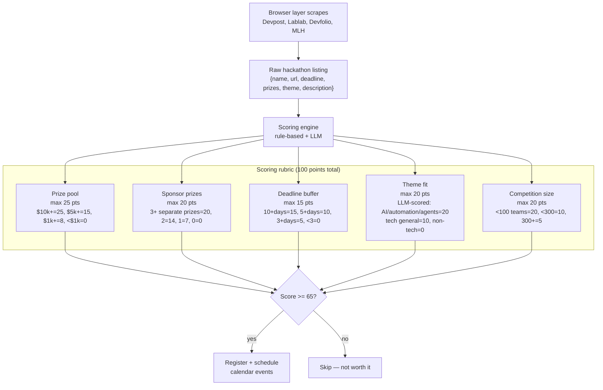
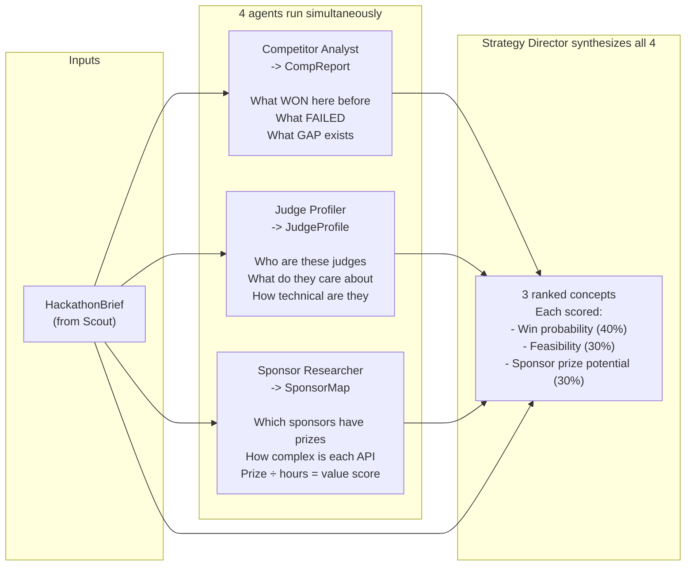
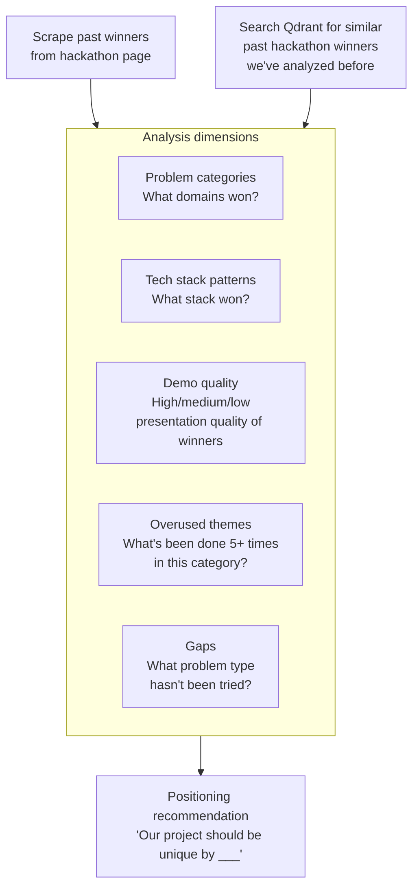
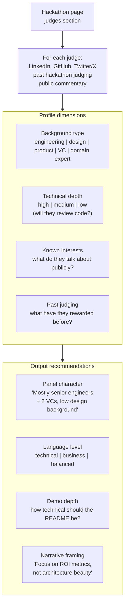
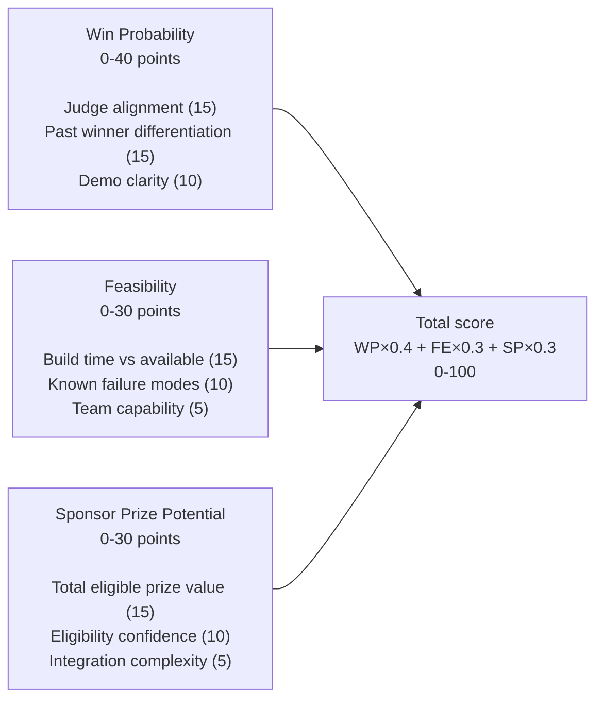
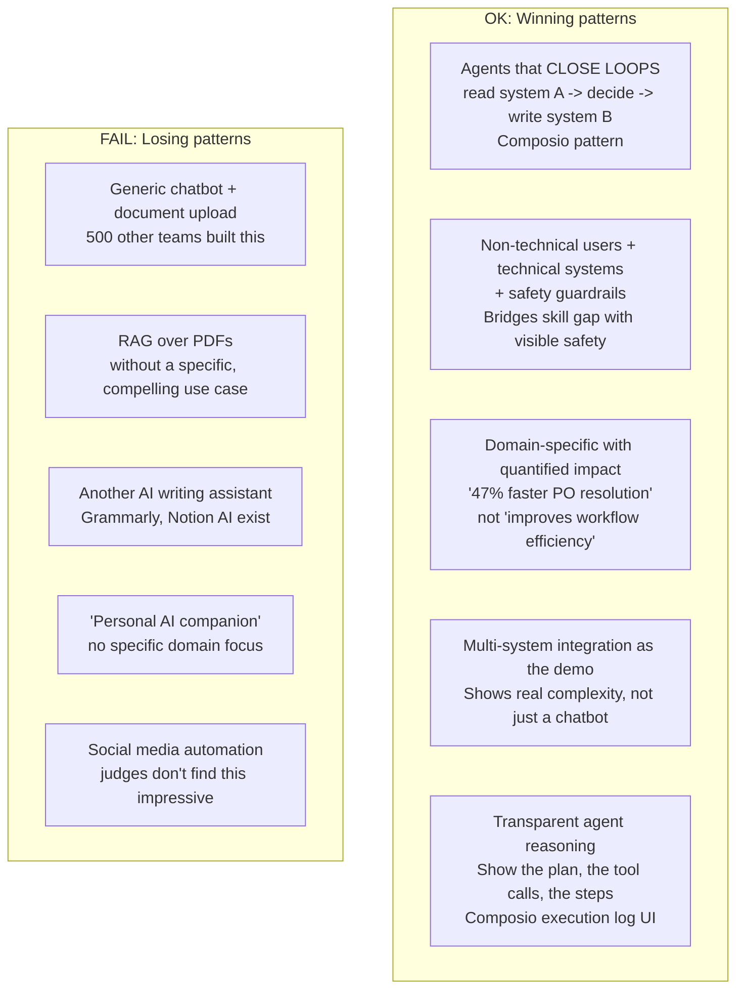
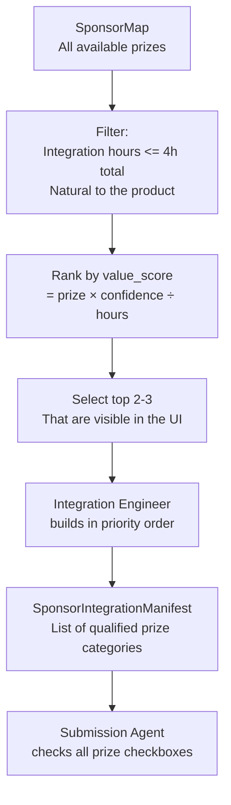

# 10 — Hackathon Intelligence

How Forge evaluates opportunities, builds competitive concepts, and calibrates to specific judges. The intelligence layer is why Forge wins rather than just submitting.

---

## Opportunity scoring



**Why 65 as the threshold?** Below 65 typically means either the prize isn't worth the agent hours OR the theme doesn't align with what Forge builds well (multi-agent AI tools, developer automation). The LLM theme-fit score is the swing factor — a $500 hackathon with a perfect AI agent theme can still score 68.

---

## The 4-agent intelligence synthesis



The Strategy Director is the only agent that sees all 4 reports simultaneously. It's designed to find intersections: a concept that fits the identified gap in past winners, that will resonate with the specific judge panel, and that naturally integrates the highest-value sponsor APIs.

---

## Competitor analysis methodology



**Why past winners matter:** Hackathons repeat. Devpost's AI Innovation track has 3 years of data. Judges who've seen "AI customer support chatbot" 20 times will respond differently to "AI that closes purchase order holds in SAP without human intervention." The CompReport explicitly finds and names the gap.

---

## Judge profiling methodology



**Why this matters for design:** A panel of 4 engineers + 1 VC should see a dense `developer_tool` aesthetic. A panel of 2 VCs + 2 product managers + 1 engineer should see a clean `enterprise_workflow` aesthetic with business metrics prominent. The UI/UX Designer reads `JudgeProfile` before selecting a design personality.

---

## Concept scoring formula



**Sponsor prize potential formula:**
```
value_score = prize_amount × eligibility_confidence ÷ integration_hours

eligibility_confidence: 1.0 (high) | 0.7 (medium) | 0.4 (low)
```

A $3,000 prize that takes 2 hours with high confidence scores 1,500. A $5,000 prize that takes 8 hours with medium confidence scores only 437. The Integration Engineer builds in value_score order.

---

## What wins vs what loses

Derived from real hackathon outcomes stored in Mem0:



These patterns are stored in `LIVING_KNOWLEDGE["winning_concept_patterns_2026"]` and updated by the Knowledge Updater before each hackathon cycle.

---

## Concept red flags (auto-penalized by Strategy Director)

```python
CONCEPT_RED_FLAGS = [
    "name ends in 'AI' or 'GPT'",
    # → SupportAI, AnalysisGPT signal generic thinking

    "first sentence includes 'leveraging the power of AI'",
    # → Marketing speak, not product thinking

    "demo requires account creation to see value",
    # → Judges won't wait; first 30 seconds matter

    "core feature is 'summarize documents' or 'answer questions about data'",
    # → Commoditized by ChatGPT; not a differentiator

    "more than 4 features listed in description",
    # → Signals lack of focus; judges prefer depth over breadth

    "demo video starts with slides before showing product",
    # → Judges fast-forward to the product; start there
]
```

---

## The specificity test

The Strategy Director applies this test to every concept before scoring it:

```
GENERIC (loses): "An AI agent that helps businesses optimize their customer service workflows"

SPECIFIC (wins):  "Sarah is a customer support team lead at a 50-person B2B SaaS company.
                  She manages 8 agents handling 200 tickets/day. 23% of tickets that come in
                  after 5pm go unresolved until the next morning, causing churn.
                  Our agent monitors the ticket queue in real-time, classifies urgency with
                  domain-specific logic, pages the right on-call person via PagerDuty, and
                  drafts a first response — all within 4 minutes."
```

The specific version names: who Sarah is, the exact metric (23%), what time (after 5pm), the specific system (PagerDuty), and the specific outcome (4 minutes). This level of specificity:
1. Shows the team understands the actual problem
2. Gives judges a person to empathize with
3. Makes the demo obvious: show Sarah's ticket queue, trigger an after-hours ticket, watch the agent respond

---

## Sponsor integration strategy



**The visibility rule:** Every integration must be visible in the product UI — a badge, a feature, a "Powered by X" attribution. Judges open the submission and scroll through the tech stack. If they can't see the sponsor's tech being used, the integration doesn't land.

**The naturalness rule:** Integrations that require rearchitecting the core product are not worth it. The best integrations are additive layers — the product works without them, but they make it meaningfully better and visibly display the sponsor's value.
